# 一、概述

## 1、Python概述

### 1.1 起源

- Python 作者：Guido van Rossum 被国内网友亲切的称为："龟叔"。荷兰人，拥有数学与计算机背景。

-  想要：既能像 C 语言那样全面操控系统、又能像 Shell 一样好上手的语言。 
- 1989 年冬天，“龟叔” 写出了 Python 的第一个解释器。 
- 1991 年正式发布了第一个 Python 版本（ Python 0.9.0 ）。

### 1.2 优点

- 易学易用：语法简洁、可读性强、代码结构清晰、上手难度低。
- 开发效率高：
  - 内置：网络通信、文本处理、数据库、图形系统等强大功能。
  - 社区：Web 开发、科学计算、人工智能等多领域的模块。
- 跨平台运行：同样的 Python 代码可以在 Windows、Linux、macOS 等多个平台上运行。
- 应用领域广：
  1. 自动化脚本、桌面工具 ……
  2. 数据处理、科学计算（Pandas、Numpy）
  3. 网络爬虫（Requests、BeautifulSoup）
  4. Web 开发（Flask、Django）
  5. AI / 机器学习（TensorFlow、PyTorch）

### 1.3 缺点

- 运行速度较慢：Python 是解释型语言，代码运行时要通过解释器 “翻译” 成机器码再执行，不像 C、C++ 等语言，事先编译成机器码直接运行。
- 代码无法加密：Python 是开源语言，最终发布的 .py 文件可以很容易被逆向查看源码逻辑，保护代码知识产权略显困难。
- 内存消耗略大：相比 C、C++ 这种紧凑型语言，Python 会更 “吃内存”，不太适合资源受限设备，比如一些微控制器等。

### 1.4 在AI领域火的原因 

- **简洁直观的开发体验**
  - AI 开发中，有很多试错、调模型、调参数等过程
  - 开发人员使用 Python 可以：更快速的实现想法，调试和维护也更简单 
  - 精力更专注在算法和逻辑上，而不是语言细节上
- **丰富强大的框架生态**
  - Python 相关的 “轮子” 特别多，而且特别好用
  - 例如：PyTorch、TensorFlow、Scikit‑learn 这些都是顶级的 AI 框架
  - 几乎你能想到的功能，都已经有人帮你封装好了，用起来特别方便
- **与底层语言高效协作**
  - 但很多 AI 框架表面是 Python，其实底层是用 C 或 C++ 实现的。 
  - 矩阵运算、GPU 加速的部分，是由底层的高性能代码完成的。 
  - Python 是 “指挥员”，负责写流程、调度这些高性能的代码
- **社区活跃且人才充足**
  - Python 拥有庞大且活跃的社区，全球无数科研人员、工程师在分享经验。 
  - 在各个领域中，基于 Python 所研发的工具包和解决方案层出不穷。 
  - 校园中广泛推广 Python，企业的 AI 项目将 Python 作为主要开发语言
- **业内大厂 + 主流推动**
  - 2015 年谷歌开源 TensorFlow、2016 年 Facebook 开源 PyTorch
  - 头部大厂所出的 AI 框架，第一时间支持的就是 Python
  - 从学术实验，到工业领域的机器学习，都大量采用 Python 编写

2、

## 3、win环境安装

### 3.1 下载

- python官网：https://www.python.org/

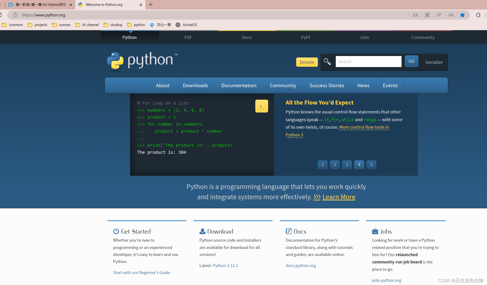

- 官网下载Windows版本：https://www.python.org/downloads/windows/

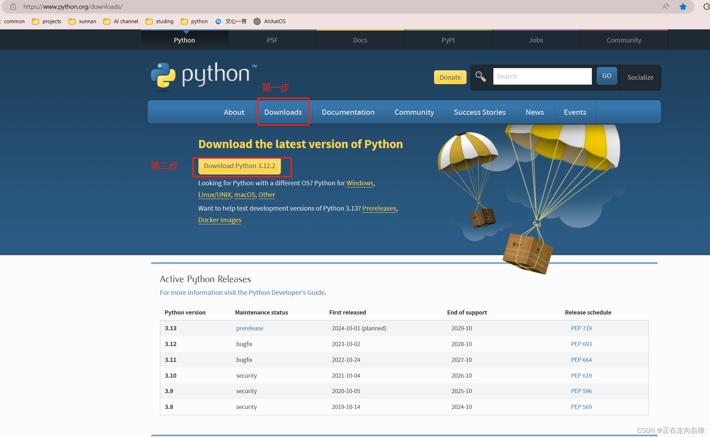

- 下载后如图所示

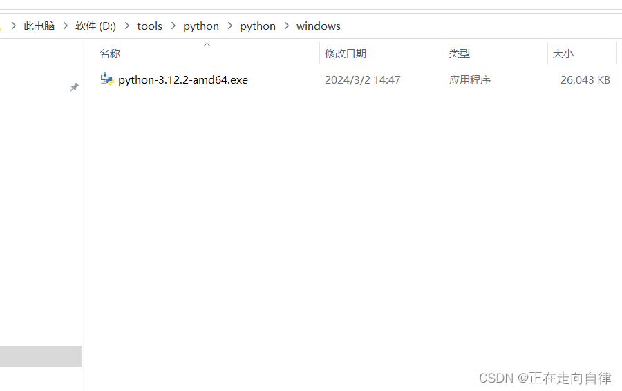

### 3.2 安装

- 点击安装程序

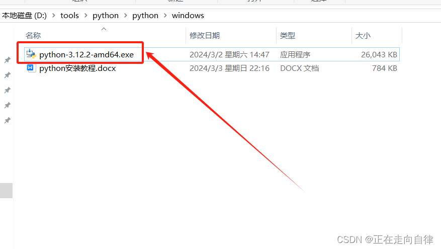

- 如下图，建议选择自定义安装，确保勾选 "Add Python.exe to PATH" 选项（将 Python 添加到系统环境变量中，这样可以在命令行中直接运行 python 命令）

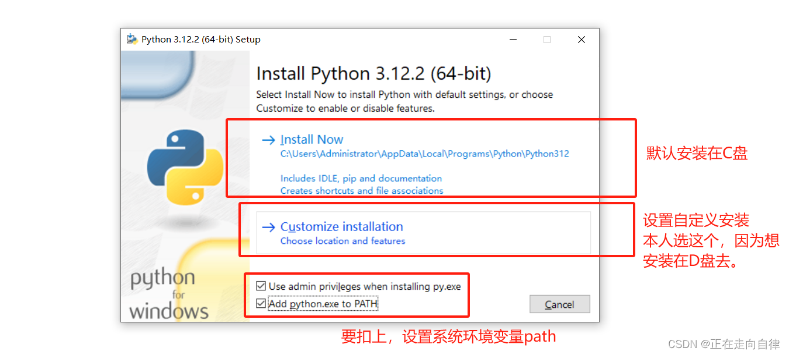

- 如下图，直接默认下一步

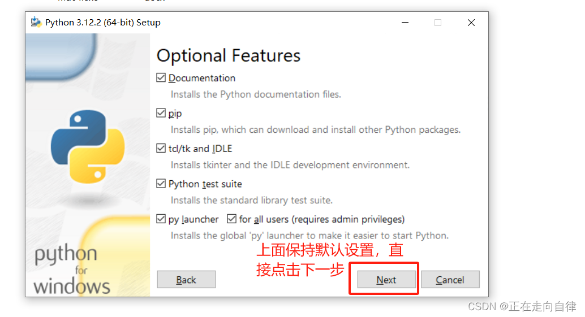

- 正在安装中

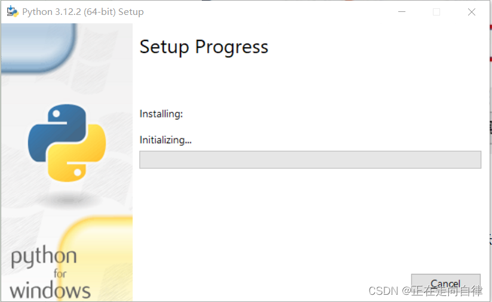

- 如下图，有一个提示Disable path length limit 点击关闭长度的限制，点击它然后安装完成。

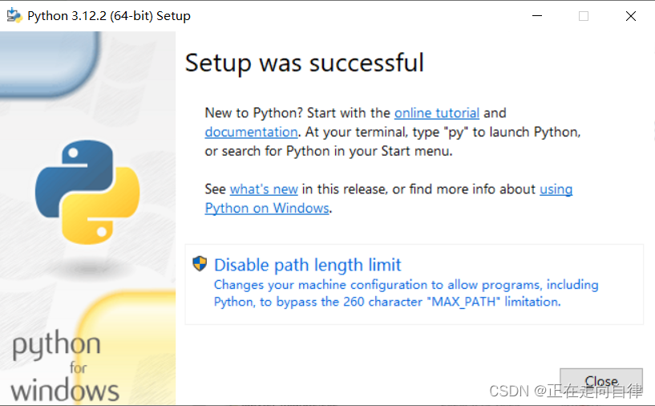

### 3.3 验证安装

- 打开终端或命令提示符cmd（Windows用户）。

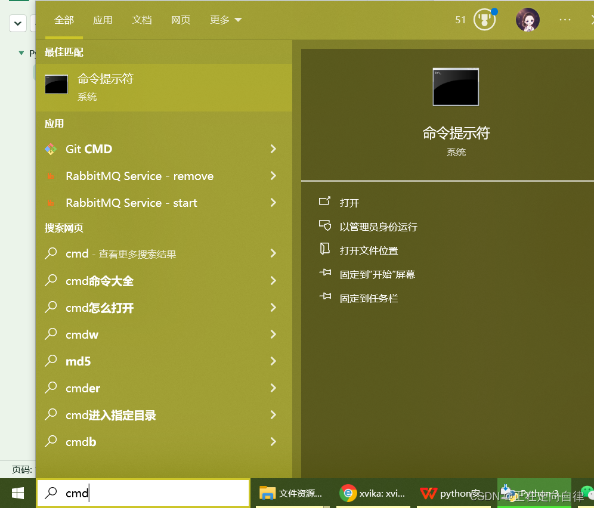

-  输入“python --version”或“python3 --version”，确认Python是否已成功安装。如果输出版本号，则表示安装成功。

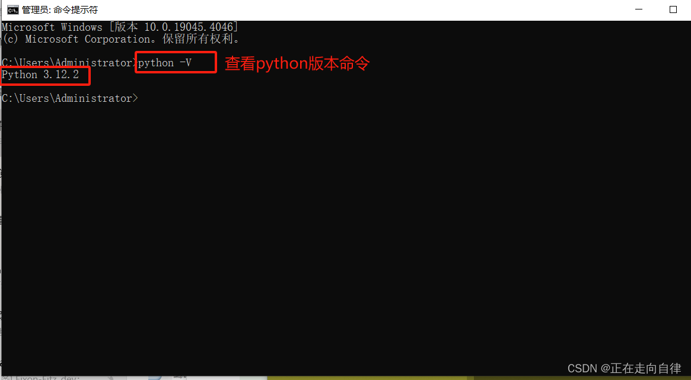

- 输入“python”或“python3”，进入Python交互式环境。你可以在这里编写和运行Python代码。

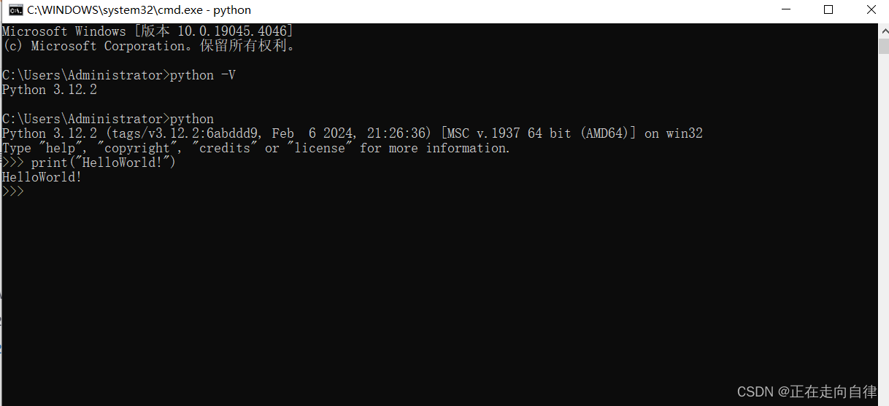

- 查看pip版本

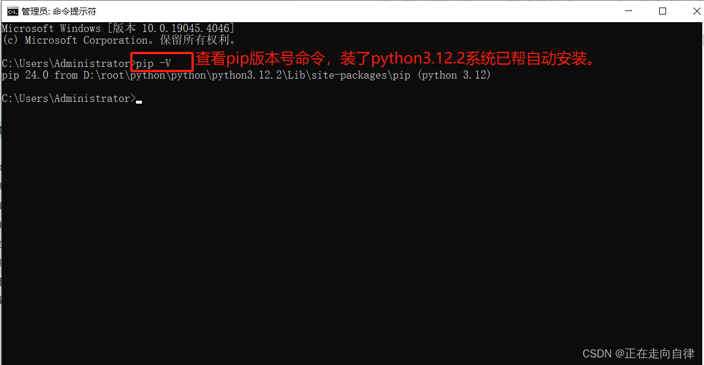

