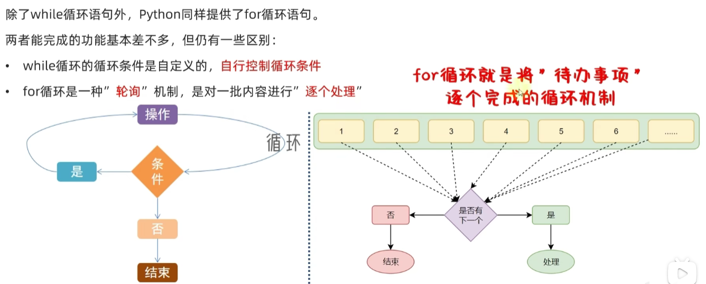
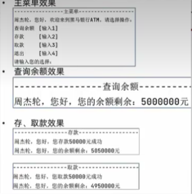
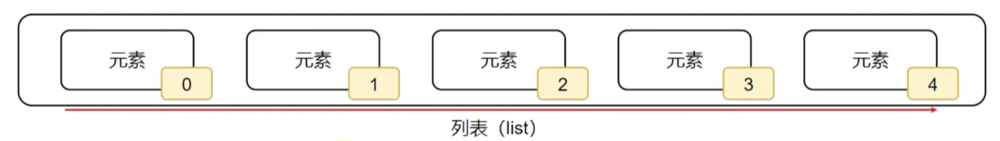
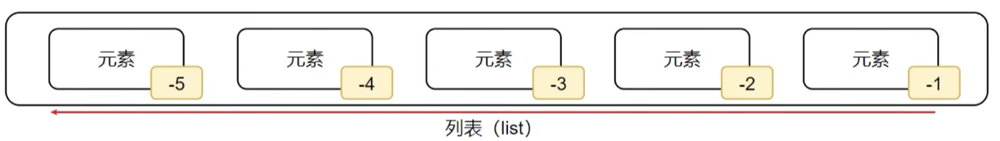
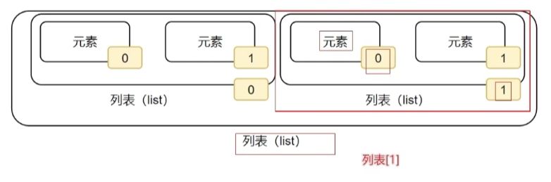
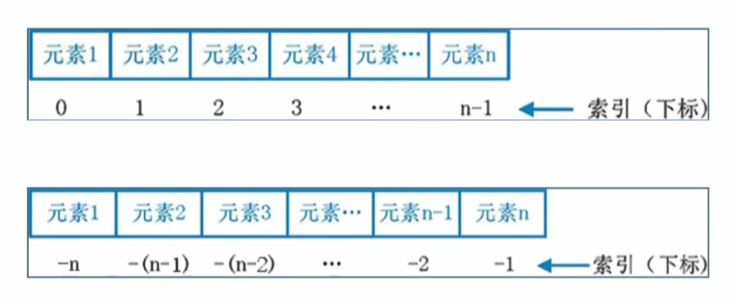

# 一、概述

## 1、Python概述

### 1.1 起源

- Python 作者：Guido van Rossum 被国内网友亲切的称为："龟叔"。荷兰人，拥有数学与计算机背景。

-  想要：既能像 C 语言那样全面操控系统、又能像 Shell 一样好上手的语言。 
- 1989 年冬天，“龟叔” 写出了 Python 的第一个解释器。 
- 1991 年正式发布了第一个 Python 版本（ Python 0.9.0 ）。


### 1.2 优点

- 易学易用：语法简洁、可读性强、代码结构清晰、上手难度低。
- 开发效率高：
  - 内置：网络通信、文本处理、数据库、图形系统等强大功能。
  - 社区：Web 开发、科学计算、人工智能等多领域的模块。
- 跨平台运行：同样的 Python 代码可以在 Windows、Linux、macOS 等多个平台上运行。
- 应用领域广：
  1. 自动化脚本、桌面工具 ……
  2. 数据处理、科学计算（Pandas、Numpy）
  3. 网络爬虫（Requests、BeautifulSoup）
  4. Web 开发（Flask、Django）
  5. AI / 机器学习（TensorFlow、PyTorch）


### 1.3 缺点

- 运行速度较慢：Python 是解释型语言，代码运行时要通过解释器 “翻译” 成机器码再执行，不像 C、C++ 等语言，事先编译成机器码直接运行。
- 代码无法加密：Python 是开源语言，最终发布的 .py 文件可以很容易被逆向查看源码逻辑，保护代码知识产权略显困难。
- 内存消耗略大：相比 C、C++ 这种紧凑型语言，Python 会更 “吃内存”，不太适合资源受限设备，比如一些微控制器等。


### 1.4 在AI领域火的原因 

- <font color="red">**简洁直观的开发体验**</font>
  - AI 开发中，有很多试错、调模型、调参数等过程
  - 开发人员使用 Python 可以：更快速的实现想法，调试和维护也更简单 
  - 精力更专注在算法和逻辑上，而不是语言细节上
- <font color="red">**丰富强大的框架生态**</font>
  - Python 相关的 “轮子” 特别多，而且特别好用
  - 例如：PyTorch、TensorFlow、Scikit‑learn 这些都是顶级的 AI 框架
  - 几乎你能想到的功能，都已经有人帮你封装好了，用起来特别方便
- <font color="red">**与底层语言高效协作**</font>
  - 但很多 AI 框架表面是 Python，其实底层是用 C 或 C++ 实现的。 
  - 矩阵运算、GPU 加速的部分，是由底层的高性能代码完成的。 
  - Python 是 “指挥员”，负责写流程、调度这些高性能的代码
- <font color="red">**社区活跃且人才充足**</font>
  - Python 拥有庞大且活跃的社区，全球无数科研人员、工程师在分享经验。 
  - 在各个领域中，基于 Python 所研发的工具包和解决方案层出不穷。 
  - 校园中广泛推广 Python，企业的 AI 项目将 Python 作为主要开发语言
- <font color="red">**业内大厂 + 主流推动**</font>
  - 2015 年谷歌开源 TensorFlow、2016 年 Facebook 开源 PyTorch
  - 头部大厂所出的 AI 框架，第一时间支持的就是 Python
  - 从学术实验，到工业领域的机器学习，都大量采用 Python 编写


## 2、编译型语言 vs 解释型语言

### 2.1 核心概念

- <font color="red">**编译型**：**全部源码 → 编译器一次性编译成机器码（可执行文件）**</font>，之后直接运行机器码，不再需要源码。
  - 通俗比喻：写完整篇演讲稿，一次性翻译成外文稿件，直接拿着翻译稿上台演讲
- <font color="red">**解释型**：**不整体提前编译**</font>，由解释器边读源码、边翻译、边执行，源码运行时才逐行处理
  - 通俗比喻：一边看中文稿子，现场一句一句口译给听众


### 2.2 对比

| 对比维度 | 编译型语言 (C/C++、Go、Rust)                       | 解释型语言 (Python、JavaScript、PHP)         |
| -------- | -------------------------------------------------- | -------------------------------------------- |
| 执行流程 | 源码 → 编译 → 机器码程序 → 运行                    | 源码 → 解释器逐行翻译执行                    |
| 运行速度 | **快**，直接 CPU 执行机器码                        | **慢**，运行期实时翻译有开销                 |
| 发布产物 | 生成独立 exe / 二进制文件，可脱离源码              | 一般直接发布源代码，运行依赖解释器环境       |
| 跨平台   | 一份源码，**不同系统分别编译**；编译后产物不跨平台 | 一套源码，只要装对应解释器，多平台直接跑     |
| 报错时机 | 编译阶段就报大部分错误，没编译通过不能运行         | 运行到出错那一行才抛出异常，前面代码会先跑完 |
| 典型代表 | C、C++、Go、Rust                                   | Python、JS、Ruby、PHP                        |


## 3、win环境安装

### 3.1 下载

- python官网：https://www.python.org/


- 官网下载Windows版本：https://www.python.org/downloads/windows/


- 下载后如图所示


### 3.2 安装

- 点击安装程序


- 如下图，建议选择自定义安装，确保勾选 "Add Python.exe to PATH" 选项（将 Python 添加到系统环境变量中，这样可以在命令行中直接运行 python 命令）


- 如下图，直接默认下一步


- 正在安装中


- 如下图，有一个提示Disable path length limit 点击关闭长度的限制，点击它然后安装完成。


### 3.3 验证安装

- 打开终端或命令提示符cmd（Windows用户）。


-  输入“python --version”或“python3 --version”，确认Python是否已成功安装。如果输出版本号，则表示安装成功。


- 输入“python”或“python3”，进入Python交互式环境。你可以在这里编写和运行Python代码。


- 查看pip版本


## 4、第一个python程序

### 4.1 代码编写

- 打开cmd，输入python进入交互界面，输入下面代码后回车

~~~python
print('hello world')
~~~

- 输出：hello world

- 注意：<font color="red">**输入的双引号和括号都要使用英文的**</font>


### 4.2 保存文件运行

- 保存代码在文件中，文件后缀为 .py
- 运行：打开cmd，执行：python py文件路径


### 4.3 第一个程序的常见问题

- 在命令提示符内输入 python 时，出现提示：

  ```
  'python' 不是内部或外部命令，也不是可运行的程序或批处理文件。
  ```

  - 原因：安装 Python 时，没有勾选 **Add Python 3.10 to PATH** 选项。

  - 解决步骤：

    1. 卸载当前 Python 程序。

    1. 重新运行 Python 安装程序，**务必勾选** Add Python 3.10 to PATH 选项（同时可勾选 Install launcher for all users (recommended)）。

    1. 安装完成后，重新打开命令提示符程序，即可正常使用 python 命令。

- 在命令提示符内直接执行 Python 代码时，出现提示：

  ```
  无法初始化设备 PRN
  ```

  - 原因：**没有进入 Python 解释器环境**，直接在 CMD 中执行了 Python 代码，系统误将 print 识别为 DOS 打印命令。
  - 解决步骤：
    - 在命令提示符中先输入 python，按下回车，等待出现 >>> 标记，代表已进入 Python 交互环境。
    - 在 >>> 后输入 Python 代码（如 print("Hello World!!!!")），再按下回车执行。

- 在 Python 交互环境中执行代码时，出现语法错误：

  ```
  SyntaxError: invalid character '“' (U+201C)
  ```

  - 原因：代码中使用了**中文符号**，Python 语法只识别英文符号。
  - 需要检查并修正的符号：
    - **双引号**：必须使用英文双引号 " "，不能使用中文双引号 “ ”
    - **小括号**：必须使用英文小括号 ( )，不能使用中文小括号 （ ）


# 二、基础语法

## 1、字面量

- 字面量：在代码中，<font color="red">**被写下来的固定的值**</font>，称为字面量，就是直接写在代码中的<font color="red">**具体值**</font>
- Python 的字符串中可以包含<font color="red">**任意字符**</font>，且必须使用<font color="red">**引号**</font>包起来。
- 字符串的引号，可以是：<font color="red">**单引号**、**双引号**、**三个单引号**、**三个双引号**</font>
- 写在 Python 文件**头部**的字符串，会被自动识别成 **docstring**（文档字符串）。
- 文档字符串的主要作用是：对当前 Python 文件进行一些**说明**，且文档字符串必须用<font color="red">**三个双引号**</font>

~~~python
"""这是一个文档字符串"""

'字面量1'
"字面量2"
'''字面量3'''
"""字面量4"""
~~~


## 2、变量

- 变量：<font color="red">**在程序运行时**</font>，能<font color="red">**存储**</font>计算结果或能<font color="red">**表示值**</font>的抽象概念
  - 变量其实就是一个代号，用来和某个值建立绑定关系
  - 当我们想读取或修改某个值的时候，可以通过变量去完成读取和修改操作
  - 之所以叫变量，是因为它和某个值的绑定关系，<font color="red">**可以随时改变**</font>

- 简单的说，<font color="red">**变量就是程序运行时，记录数据用的**</font>
- 定义格式
  - 变量名：每一个变量都有自己的名称，称之为：<font color="red">**变量名，也就是变量本身**</font>
  - =：赋值，表示<font color="red">**将等号右边的值，赋给左侧的变量**</font>
  - 变量值：每一个变量都有自己存储的值（内容），称之为：<font color="red">**变量值**</font>

~~~python
变量名 = 变量值
~~~

- 变量的特征：变量值可以改变

~~~python
# 定义一个变量
money = 10
print("金额为：", money)

# 变量改变
money = money + 1
print("修改后的金额为：", money)

"""
输出：
金额为： 10
修改后的金额为： 11
"""
~~~


## 3、标识符

- 在python程序中，可以给很多东西取名，比如：
  - 变量名
  - 方法名
  - 类名
- 这些名字，统一称为标识符，用来左内容的标识
- 总结：<font color="red">**标识符是用户在编程的时候所使用的一系列名字，用于给变量、类、方法等命名**</font>

- 标识符命名规则
  - <font color="red">**内容限定**</font>：只允许出现英文、中文、数字、下划线_这四类
    - 不推荐使用中文
    - 数字不可以开头
  - <font color="red">**大小写敏感**</font>：小写字母和大写字母是不一样的
  - <font color="red">**不可以使用关键字**</font>：python中有一系列单词是关键字，有特定作用，所以标识符命名不可以用这些

~~~python
# 内容限定：只允许出现英文、中文、数字、下划线_这四类，数字不可以开头
# 错误代码示例：1_name = "张三"
# 错误代码示例：name_! = "张三"
name_1 = "张三"
print(name_1)

# 大小写敏感
a = "lzy"
A = "lzy"
print(a)
print(A)

# 不可以使用关键字
# 错误代码示例：True = "123"
~~~

- 标识符命名规范

  - 变量命名
    - 明了：变量名要能明确知道他是干啥的
    - 简洁：在确保"明了"的前提下，减少名字长度
    - <font color="red">**多个单词组合变量名，要使用下划线做分隔**</font>
    - <font color="red">**命名变量中的英文字母要全小写**</font>

  ~~~python
  single_name = "lzy"
  ~~~


## 4、常量

- 常量：<font color="red">**一旦被赋值，就不希望被修改的量（区别于变量）**</font>
- Python 中一般约定使用<font color="red">**全大写变量名**</font>来表示常量，涉及到多个单词时，用下划线做分隔。
- Python中没有强制的常量机制，Python中所谓的常量，其本质还是变量，只不过约定好了不去修改

~~~python
# 一年12个月
MONTH_COUNT = 12
~~~


## 5、注释

- 注释：在程序代码中对程序代码进行解释说明的文字

- 作用：注释不是程序，<font color="red">**不能被执行**</font>，只是对程序代码进行解释说明，让别人可以看懂程序代码的作用，能够大大增强程序的可读性

- 注释类型

  - 单行注释：以 <font color="red">**#开头**</font>，#右边的所有文字当作说明，而不是真正要执行的程序，起辅助说明作用
    - 注：<font color="red">**#号和注释内容一般建议一个空格隔开**</font>

  ~~~python
  # 这是单行注释
  print("单行注释")
  ~~~

  - 多行注释：以<font color="red">**一对三个双括号**</font>引起来，("""注释内容""")来解释说明一段代码的作用和使用方法
    - 备注：python中其实没有真正的多行注释语法，多行注释实际上是一个字符串字面量，只是没有去使用而已，所以起到了一个注释的作用


  ~~~python
  """
  多行注释1
  多行注释2
  """
  print("多行注释")
  ~~~

  - 文件编码注释：写在python文件开头，用于指定当前文件的字符编码

  ~~~python
  #coding=iso8859-1
  
  # 你好
  print('你好')
  
  # 这个编码不支持中文，所以打印乱码：你好
  ~~~

  

## 6、字符编码

- 字符编码
  - utf‑8 又称万国码，全球语言通吃，可以对任意语言进行编码
  - <font color="red">**Python3 中默认的编码方式是 utf‑8，Python3 中无需编写文件编码注释。**</font>

- 分类
  - ASCII => 大写字母、小写字母、数字、一些符号，共计 128 个。
  - ISO 8859‑1 => 在 ASCII 基础上，扩充了一些希腊字符等，共计是 256 个。
  - GB2312 => 继续扩充，收录了 6763 个常用汉字、682 个字符。
  - GBK => 收录了的汉字和符号达到 20000+，支持繁体中文。 
  - UTF‑8 => 万国码，包含世界上所有语言的：所有文字与符号。

- 存储原则
  - 存储时，务必采用合适的字符编码，否则无法存储，数据会乱码
  - 存储时采用的那种方式编码，读取时就必须采用相同方式解码，否则数据能呈现，但是是乱码


## 7、数据类型

### 7.1 常见的数据类型

- python中有6种数据类型

| 类型               | 描述                   | 说明                                                         |
| ------------------ | ---------------------- | ------------------------------------------------------------ |
| 数字（Number）     | 整数（int）            | 整数（int），如：10、-10                                     |
|                    | 浮点数（float）        | 浮点数（float），如：13.14、-13.14                           |
|                    | 复数（complex）        | 复数（complex），如：4+3 j，以 j 结尾表示复数                |
|                    | 布尔（bool）           | 布尔（bool）表达现实生活中的逻辑，即真和假，True表示真，False表示假。<font color="red">**True本质上是一个数字记作1，False记作0**</font> |
| 字符串（String）   | 描述文本的一种数据类型 | 字符串（String）由任意数量的字符组成                         |
| 列表（List）       | 有序的可变序列         | 使用最频繁的数据类型，可有序记录一堆数据                     |
| 元组（Tuple）      | 有序的不可变序列       | 可有序记录一堆不可变的python数据集合                         |
| 集合（Set）        | 无序不重复集合         | 可无序记录一堆不重复的python数据集合                         |
| 字典（Dictionary） | 无序key-value集合      | 可有序记录一堆key-value型的python数据集合                    |

- 字符串（String）：又称文本，由任意数量的字符如中文、英文、各类符号、数字等组成。所以叫做字符的串
  - python中，<font color="red">**字符串需要用引号包起来，被引号包起来的，都是字符串**</font>
  - 如："lzy"、"djb"
- 最常用的字面量

| 类型           | 程序中的写法 | 说明                                                         |
| -------------- | ------------ | ------------------------------------------------------------ |
| 整数           | 666、-88     | 和现实中的写法一致                                           |
| 浮点数（小数） | 13.14、-5.21 | 和现实中的写法一致                                           |
| 字符串（文本） | "lzy"        | <font color="red">**程序中需要加上双引号来表示字符串**</font> |

- 用print打印上述字面量

~~~python
print(666)
print(13.14)
print("lzy")
~~~


### 7.2 type查看类型

- 用type查看数据的类型
  - 可以查看字面量的类型
  - 可以查看变量的类型
  - <font color="red">**type带返回值，一般用print()打印type输出**</font>

~~~python
type(被查看数据)
print(type(被查看数据))
~~~

- 例子

~~~python
# 打印字面量类型
print(type(10))
print(type(1.15))
print(type("lzy"))

# 打印变量量类型
a = 10
b = 1.15
c = "lzy"
print(type(a))
print(type(b))
print(type(c))

"""
输出：
<class 'int'>
<class 'float'>
<class 'str'>
<class 'int'>
<class 'float'>
<class 'str'>
"""
~~~

- 问题：
  - 通过type(变量)可以输出类型，那么是查看变量的类型还是数据的类型
    - <font color="red">**查看的是：变量存储的数据的类型**</font>。因为变量无类型，但是它存储的数据有
    - <font color="red">**变量是没有类型的**</font>


### 7.3 整型

- 所谓整型，就是没有小数点的数字，可以是正数，也可以是负数，也可以是0
- 当数很大时，我们可以使用下划线将数字进行分组，来让数字变得更易读
- python中整数的上限值，取决于执行代码的计算机的内存和处理能力
- 注意：
  - print(大数字)的时候，会报错：超出4300位，这不是说整型的最大长度就是4300，而是print()的机制问题，打印数字时，会把数字转为字符串打印。**为防止攻击者用超长的数字字符串（如 4300 位以上）触发 int() 转换时耗尽 CPU 和内存（DoS 攻击），解释器默认拒绝这类转换**
  - 用sys.set_int_max_str_digits(0)这个解除限制

~~~python
# 所谓整型，就是没有小数点的数字，可以是正数，也可以是负数，也可以是0
age = 18
score = 99

# 当数很大时，我们可以使用下划线将数字进行分组，来让数字变得更易读
money = 300_000
people_count = 14_0000_0000
print(money, people_count)
# 打印：300000 1400000000

# python中整数的上限值，取决于执行代码的计算机的内存和处理能力
a = 9 ** 9999
print(a)
# 打印：ValueError: Exceeds the limit (4300 digits) for integer string conversion; use sys.set_int_max_str_digits() to increase the limit

# 0 = 完全取消限制
sys.set_int_max_str_digits(0)
print(a)

# 或者按需调大，比如允许 10 万位
# sys.set_int_max_str_digits(100000)
~~~


### 7.4 浮点型

- 浮点型就时带有小数点的数字
- 浮点型的科学计数法表示：<font color="red">**小数部分 + e/E + 指数部分** </font>

~~~python
# 浮点型就时带有小数点的数字
height = 172.9
weight = 68.3

# 浮点型的科学计数法表示
speed_of_sound = 3.4e+2             # 3.4乘以10的2次方
world_population = 7.8e9            # 7.8乘以10的9次方
distance_sun_earth = 1.496E8        # 1.496乘以10的8次方
speed_of_light = 2.998E+8           # 2.998乘以10的8次方
print(speed_of_sound, world_population, distance_sun_earth, speed_of_light)

one_ml = 1e-3   # 1乘以10的-3次方
one_mg = 1E-3   # 1乘以10的-3次方
print(one_ml, one_mg)

# 打印：
# 340.0 7800000000.0 149600000.0 299800000.0
# 0.001 0.001
~~~


### 7.5 字符串

#### 7.5.1 四种定义方式

- 字符串在python中有多种定义形式
  - 单引号定义法：name = 'lzy'
  - 双引号定义法：name = "lzy"
  - 三单引号定义法：name = '''lzy'''
  - 三双引号定义法：name = """lzy"""
    - 三引号定义法，和多行注释一样，支持换行操作
    - 使用变量接收它，它就是字符串
    - 不使用变量接收，就可以作为多行注释使用

~~~python
# 单引号
name1 = '单引号'

# 双引号
name2 = "双引号"

# 三单引号
name3 = '''
三单引号1
三单引号2
三单引号3
'''

# 三双引号
name4 = """
三双引号1
三双引号2
三双引号3
"""

print(name1)
print(name2)
print(name3)
print(name4)

"""
输出结果：
单引号
双引号

三单引号1
三单引号2
三单引号3


三双引号1
三双引号2
三双引号3
"""
~~~


#### 7.5.2 字符串拼接

- 如果有两个字符串（文本）字面量，可以将其拼接成一个字符串，通过+号即可完成
  - print("lzy " + "djb")
  - 输出：lzy djb
- 字面量和变量 或 变量和变量之间也可以使用拼接

```python
# 正常拼接
name = "lzy"
address = "湖北武汉"
print("你好 " + name)
print(name + "住在" + address)

# 非正常拼接
age = 18
print("年龄 " + age)

"""
输出结果
Traceback (most recent call last):
  File "D:\AI\code\final\multimodal\api\multimodal\Test.py", line 9, in <module>
    print("年龄 " + age)
          ~~~~~~~~^~~~~
TypeError: can only concatenate str (not "int") to str
你好 lzy
lzy住在湖北武汉
"""
```

- 注意：<font color="red">**无法和非字符串之间进行拼接**</font>


#### 7.5.3 格式化输出1

- 问题：
  - <font color="red">**变量过多，拼接起来很麻烦**</font>
  - <font color="red">**字符串无法和数字或者其他类型完成拼接**</font>
- 使用字符串格式化的语法，完成字符串和变量的快速拼接
  - 其中%s
    - %表示：占位
    - s表示：将变量变成字符串放入占位的地方
    - 所以，综合起来的意思：先占个位置，等会有个变量过来，就把它变成字符串放到占位的位置
  - <font color="red">**多个变量占位，变量要用括号包起来，并按照占位顺序填入**</font>

```python
name = "lzy"
massage = "你好 %s" % name
print(massage)

age = 18
message = "%s今年%s岁" % (name, age)
print(message)

"""
结果
你好 lzy
lzy今年18岁
"""
```

- python中常用的数据类占位符

| 格式符号 | 转化                                                         |
| -------- | ------------------------------------------------------------ |
| %s       | 将内容转换为字符串，放入占位位置（万能的，如果碰上会自动把数字类型转为字符串填充） |
| %d       | 将内容转换为十进制整数，放入占位位置                         |
| %i       | 将内容转换为整数，放入占位位置                               |
| %f       | 将内容转换为浮点数，放入占位位置                             |

```python
name = "lzy"
age = 18
salary = 8888.88
message = "%s今年%d岁,工资%f" % (name, age, salary)
print(message)

"""
结果：
lzy今年18岁,工资8888.880000
"""
```


#### 7.5.4 格式化输出2

- 通过语法：<font color="red">**f"内容{变量}"的格式来快速格式化**</font>
- 特点
  - 不理会类型
  - 不做精度控制
- 适用于对精度没有要求的时候快速使用

```python
name = "lzy"
age = 18
message = f"{name}的年龄为{age}"
print(message)

"""
输出结果
lzy的年龄为18
"""
```


#### 7.5.5 格式化的精度控制

- 问题：上面的小数格式化的时候，8888.88输出后面多了4个0，现在想要只保留两位小数
- 使用辅助符号 "m.n" 来控制数据的宽度和精度
  - m：控制宽度，要求是数字（很少使用），<font color="red">**设置的宽度小于数字自身，不生效**</font>，**正数右对齐，负数左对齐**
  - n：控制小数点精度，要求是数字，<font color="red">**不够的用0补齐，多了会进行小数的四舍五入**</font>
- 示例：
  - %5d，表示将整数的宽度控制在5位，如数字11，被设置成5d，就会变成：\[空格]\[空格]\[空格]11，用三个空格在左边补齐宽度
  - %-5d，左对齐，输出结果：11\[空格]\[空格]\[空格]
  - %5.2f，表示将宽度控制为5，小数点精度设置为2，小数点和小数部分也算入宽度计算。如11.345设置了%7.2f后，结果是\[空格]\[空格]11.35，2个空格补齐宽度，小数部分限制2位精度，四舍五入位.35

```python
num1 = 11
num2 = 11.345
print("数字11宽度限制5，结果是%-5d" % num1)
print("数字11宽度限制5，结果是%5d" % num1)
print("数字11宽度限制1，结果是%1d" % num1)
print("数字11.345宽度限制7，小数精度为2，结果是%-7.2f" % num2)
print("数字11.345宽度限制7，小数精度为2，结果是%7.2f" % num2)
print("数字11.345不限制宽度，小数精度为2，结果是%.2f" % num2)

"""
输出结果
数字11宽度限制5，结果是11   
数字11宽度限制5，结果是   11
数字11宽度限制1，结果是11
数字11.345宽度限制7，小数精度为2，结果是11.35  
数字11.345宽度限制7，小数精度为2，结果是  11.35
数字11.345不限制宽度，小数精度为2，结果是11.35
"""
```


#### 7.5.6 转义字符

- 转义字符：在字符串中用于表示<font color="red">**特殊含义的字符组合**</font>，通常以<font color="red">**反斜杠**</font>开头，通常用于表示那些在字符串中不能直接写出的字符
- 反斜杠和后面的字符是一个整体
- 常见转义符
  - \n：换行
  - \t：制表符
  - \\'：单引号
  - \\：双引号
  - \\\：单斜杠
  - \b：删除前一个字符
  - \r：使光标回到本行开头，覆盖输出

~~~python
print('\'你好\'')
print('\“你好\”')
print('你好\n我是lzy')
print('你好\t我是lzy')
print('你好\b')
print('你好\\')
print('%34\r%35')

# 打印：
"""
'你好'
\“你好\”
你好
我是lzy
你好	我是lzy
你
你好\
%35
"""
~~~


### 7.6 布尔类型

- 布尔（bool）表达现实生活中的逻辑，即真和假，True表示真，False表示假。<font color="red">**True本质上是一个数字记作1，False记作0**</font>
- 布尔类型的字面量
  - True 表示 真（是）
  - False 表示 假（否）
- 定义变量存储布尔类型数据：<font color="red">**变量名 = 布尔类型字面量**</font>
- 布尔类型不仅可以通过自行定义出来，也可以通过计算得来，即：<font color="red">**通过比较运算符进行比较运算得到布尔类型的结果**</font>

```python
result = 10 > 5
print(f"10 > 5的结果是：{result}, 类型为：{type(result)}")

result = (True == 1)
print(result)

"""
结果
10 > 5的结果是：True, 类型为：<class 'bool'>
True
"""
```


### 7.7 数据类型转换

- 数据类型之间，在特定的场景下，是可以互相转换的，如字符串转数字、数字转字符串等
- 数据类型转换的场景
  - 从文件中读取的数字，默认是字符串，需要转为数字类型
  - 后续input()语句，默认结果是字符串，若需要数字也需要转换
  - 将数字转换成字符串用于写到外部系统
  - 等等
- 转换方法：<font color="red">**这三个方法都是带返回值的，可以直接用print()打印**</font>

| 语句(函数) | 说明                |
| ---------- | ------------------- |
| int(x)     | 将x转换为一个整数   |
| float(x)   | 将x转换为一个浮点数 |
| str(x)     | 将x转换为一个字符串 |

- 注意：
  - <font color="red">**浮点数转整数，会丢失精度，也就是小数部分**</font>
  - <font color="red">**字符串转数字，字符串必须要是数字才可以转，不然就会报错**</font>
- 例子

```python
# 整数转浮点数
float_num = float(10)
print(float_num)

# 浮点数转整数
int_num = int(1.5)
print(int_num)

# 数字转字符串
num_str = str(11)
print(type(num_str), num_str)

float_str = str(1.5)
print(type(float_str), float_str)

# 字符串转数字
num1 = int("10")
print(type(num1), num1)

num2 = float(1.5)
print(type(num2), num2)

num3 = int("lzy")
print(type(num3), num3)


"""
10.0
1
<class 'str'> 11
<class 'str'> 1.5
<class 'int'> 10
<class 'float'> 1.5
Traceback (most recent call last):
  File "D:\AI\code\final\multimodal\api\multimodal\Test.py", line 23, in <module>
    num3 = int("lzy")
           ^^^^^^^^^^
ValueError: invalid literal for int() with base 10: 'lzy'
"""
```


## 8、运算符

### 8.1 算术运算符

| 运算符 | 描述   | 实例                                          |
| ------ | ------ | --------------------------------------------- |
| +      | 加     | 两个对象相加a + b 输出结果30                  |
| -      | 减     | 一个数减另一个数 a - b = 10                   |
| *      | 乘     | 两个数相乘                                    |
| /      | 除     | b / a 输出结果为2                             |
| //     | 取整数 | 返回商的整数部分 9 // 2 = 4，9.0 // 2.0 = 4.0 |
| %      | 取余   | 返回除法的余数b % a 输出结果为0               |
| **     | 指数   | a**b为10的3次方，输出1000                     |

- 例子

```python
# 算术运算符
print("1 + 1 = ", 1 + 1)
print("1 - 1 = ", 1 - 1)
print("2 * 2 = ", 2 * 2)
print("3 / 2 = ", 3 / 2)
print("5 // 2 = ", 5 // 2)
print("5 % 2 = ", 5 % 2)
print("10 ** 3 = ", 10 ** 3)

"""
输出结果
1 + 1 =  2
1 - 1 =  0
2 * 2 =  4
3 / 2 =  1.5
5 // 2 =  2
5 % 2 =  1
10 ** 3 =  1000
"""
```


### 8.2 赋值运算符

- 赋值运算符

| 运算符 | 描述       | 实例                                                         |
| ------ | ---------- | ------------------------------------------------------------ |
| =      | 赋值运算符 | 把=右边的结果赋给左边的变量，如num = 1 + 2 * 3，结果num的值为7 |

- 复合赋值运算符

| 运算符 | 描述           | 实例                       |
| ------ | -------------- | -------------------------- |
| +=     | 加法赋值运算符 | c += a 等价于 c = c + a    |
| -=     | 减法赋值运算符 | c -= a 等价于 c = c - a    |
| *=     | 乘法赋值运算符 | c *= a 等价于 c = c * a    |
| /=     | 除法赋值运算符 | c /= a 等价于 c = c / a    |
| %=     | 取余赋值运算符 | c %= a 等价于 c = c % a    |
| **=    | 幂赋值运算符   | c \**= a 等价于 c = c ** a |
| //=    | 取整赋值运算符 | c //= a 等价于 c = c // a  |

- 例子

```python
# 赋值运算符
num = 1
num += 2
print("num += 2：", num)
num -= 2
print("num -= 2：", num)
num *= 2
print("num *= 2：", num)
num /= 2
print("num /= 2：", num)
num %= 2
print("num %= 2：", num)
num //= 2
print("num //= 2：", num)
num **= 2
print("num **= 2：", num)

"""
输出结果
num += 2： 3
num -= 2： 1
num *= 2： 2
num /= 2： 1.0
num %= 2： 1.0
num //= 2： 0.0
num **= 2： 0.0
"""
```


### 8.3 比较运算符

- 比较运算符

| 运算符 | 描述                                                         | 示例                          |
| ------ | ------------------------------------------------------------ | ----------------------------- |
| ==     | 判断内容<font color="red">**是否相等**</font>，满足为True，不满足为False | a = 3, b = 3, (a == b) 为True |
| !=     | 判断内容<font color="red">**是否不相等**</font>，满足为True，不满足为False | a = 1, b = 3, (a != b) 为True |
| >      | 判断运算符左侧内容<font color="red">**是否大于**</font>右侧内容，满足为True，不满足为False | a = 7, b = 3, (a > b) 为True  |
| <      | 判断运算符左侧内容<font color="red">**是否小于**</font>右侧内容，满足为True，不满足为False | a = 3, b = 7, (a < b) 为True  |
| \>=    | 判断运算符左侧内容<font color="red">**是否大于等于**</font>右侧内容，满足为True，不满足为False | a = 3, b = 3, (a >= b) 为True |
| <=     | 判断运算符左侧内容<font color="red">**是否小于等于**</font>右侧内容，满足为True，不满足为False | a = 3, b = 3, (a <= b) 为True |

- 例子

```python
bool_1 = True
bool_2 = False
print(f"bool_1的变量内容是：{bool_1}, 类型是{type(bool_1)}")
print(f"bool_2的变量内容是：{bool_2}, 类型是{type(bool_2)}")

num1 = 10
num2 = 5
print(f"10 == 5的而己过：{num1 == num2}")
print(f"10 != 5的而己过：{num1 != num2}")
print(f"10 > 5的而己过：{num1 > num2}")
print(f"10 < 5的而己过：{num1 < num2}")
print(f"10 >= 5的而己过：{num1 >= num2}")
print(f"10 <= 5的而己过：{num1 <= num2}")

"""
输出结果
bool_1的变量内容是：True, 类型是<class 'bool'>
bool_2的变量内容是：False, 类型是<class 'bool'>
10 == 5的而己过：False
10 != 5的而己过：True
10 > 5的而己过：True
10 < 5的而己过：False
10 >= 5的而己过：True
10 <= 5的而己过：False
"""
```


### 8.4 逻辑运算符

| 运算符 |  名称  |                功能                |
| :----: | :----: | :--------------------------------: |
|  and   | 逻辑与 |     判断两侧的值，是否都为True     |
|   or   | 逻辑或 | 判断两侧的值，是否至少有一个为True |
|  not   | 逻辑非 |            对一个值取反            |

- 注意：and和or具有短路情况
  - 当and的左侧为False时，右侧执行与否都是Faslse，故而右侧就不会执行
  - 当or的左侧为True时，右侧执行与否都是True，故而右侧就不会执行
- 例子

~~~python
print(True and True)
print(True or False)
print(not True)
# 短路情况
print(False and 3 / 0)
print(True or 3 / 0)

# 打印：
"""
True
True
False
False
True
"""
~~~


## 9、进制

- 进制表示
  - 0b开头表示二进制
  - 0o开头表示八进制
  - 0x开头表示十六进制
- 注意：
  - python中所有的非十进制数字，只是代码层面的编写方式，给程序员看的
  - 在对其进行计算打印操作的时候，会自动将其转为十进制
- 进制转化

| 写法  |                        功能                         |                             示例                             |
| :---: | :-------------------------------------------------: | :----------------------------------------------------------: |
| bin() |  十进制转二进制<font color="red">**字符串**</font>  |                     bin(25) —> '0b11001'                     |
| oct() |  十进制转八进制<font color="red">**字符串**</font>  |                     oct(540) —> '0o1034'                     |
| hex() | 十进制转十六进制<font color="red">**字符串**</font> |                     hex(463) —> '0x1cf'                      |
| int() |  其他进制转十进制<font color="red">**数字**</font>  | int('0b11001', 2) —> 2<br />int('0o1034', 8) —> 540<br />int('0x1cf', 16) —> 463<br /> |

- 例子

~~~python
num1 = bin(25)
num2 = oct(540)
num3 = hex(463)
print(f'十进制转二进制，{num1}，类型：{type(num1)}')
print(f'十进制转八进制，{num2}，类型：{type(num2)}')
print(f'十进制转十六进制，{num3}，类型：{type(num3)}')

num4 = int(num1, 2)
num5 = int(num2, 8)
num6 = int(num3, 16)
print(f'二进制转十进制，{num4}，类型：{type(num4)}')
print(f'八进制转十进制，{num5}，类型：{type(num5)}')
print(f'十六进制转十进制，{num6}，类型：{type(num6)}')

# 打印：
"""
十进制转二进制，0b11001，类型：<class 'str'>
十进制转八进制，0o1034，类型：<class 'str'>
十进制转十六进制，0x1cf，类型：<class 'str'>
二进制转十进制，25，类型：<class 'int'>
八进制转十进制，540，类型：<class 'int'>
十六进制转十进制，463，类型：<class 'int'>
"""
~~~


## 10、输入语句

- print()函数可以将内容（字面量、变量等）输出到屏幕上

- 与之对应的就是input()语句，用来获取键盘输入

  - 数据输入：input
  - 数据输出：print

- 使用方法

  - 使用input()语句从键盘获取输入
  - 使用一个变量接收（存储）input语句获取的键盘输入数据
  - 获取到的数据永远都是<font color="red">**字符串类型**</font>

  ```python
  变量 = input()
  或
  变量 = input(提示信息)
  ```

- 例子：

```python
a = input("你是谁：")
print(f"你是{a}")

"""
结果
你是谁：lzy
你是lzy
"""
```


# 三、流程控制语句

## 1、分支语句

### 1.1 if语句的基本格式

- if语句的基本格式
  - <font color="red">**注意缩进**</font>：属于if语句的代码块，需要在前面填充4个空格
  - <font color="red">**条件判断后面有个冒号**</font>
  - 判断语句的结果必须是布尔类型True或者False
  - True会执行if内代码语句
  - False不会执行

```python
if 要判断的条件:
    条件成立时，要做的事情
```

- 例子

```python
age = 17
if age < 18:
    print("不可以羞羞")
    
"""
输出结果
不可以羞羞
"""
```


### 1.2 if else语句

- if else语句的基本格式
  - <font color="red">**注意缩进**</font>：属于if语句和else的代码块，需要在前面填充4个空格
  - <font color="red">**条件判断和else后面有个冒号**</font>
  - 判断语句的结果必须是布尔类型True或者False
  - True会执行if内代码语句
  - False会执行else内代码语句
  - else不需要判断条件，当if的条件不满足的时候else会执行

```python
if 条件:
    满足条件要做的事1
    满足条件要做的事2
    满足条件要做的事3
    ...
else:
    不满足条件要做的事1
    不满足条件要做的事2
    不满足条件要做的事3
    ...
```

- 例子：

```python
age = 18
if age >= 18:
    print("成年人")
else:
    print("未成年")
    
"""
输出结果
成年人
"""
```


### 1.3 if elif else语句

- if elif else语句的基本格式
  - <font color="red">**注意缩进**</font>：属于if语句、elif语句和else的代码块，需要在前面填充4个空格
  - <font color="red">**if语句、elif语句和else后面有个冒号**</font>
  - 判断语句的结果必须是布尔类型True或者False
  - 满足那个条件就执行哪个代码块的代码，所有条件都不满足就执行else的代码块内容
  - <font color="red">**判断条件是互斥且有序的**</font>，上一个条件满足就不会执行后面的代码块
  - elif可以写多个
  - else可省略不写，相当于三个独立的if判断

```python
if 条件1:
    满足条件1要做的事
    满足条件1要做的事
    ...
elif 条件2:
    满足条件2要做的事
    满足条件2要做的事
    ...
elif 条件3:
    满足条件3要做的事
    满足条件3要做的事
    ...
else:
    不满足条件要做的事1
    不满足条件要做的事2
    ...
```

- 例子：

```python
score = 60
if score >= 90.0:
    print(f"{score}分是A等")
elif score >= 80.0:
    print(f"{score}分是B等")
elif score >= 70.0:
    print(f"{score}分是C等")
elif score >= 60.0:
    print(f"{score}分是D等")
else:
    print(f"{score}分是不及格")
    
"""
输出结果
60分是D等
"""
```


### 1.4 判断语句的嵌套

- 基础语法格式如下

```python
if 条件1:
    满足条件1要做的事情1
    满足条件1要做的事情2
    
    if 条件2:
        满足条件2要做的事情1
        满足条件2要做的事情1
```

- 第二个if，属于第一个if内，只有第一个if满足条件，才会执行第二个if
- 嵌套的关键点
  - <font color="red">**空格缩进**</font>
  - 通过空格缩进，来决定语句之间的：<font color="red">**层级关系**</font>
- 例子

```python
print("欢迎来到动物园")
if int(input("请输入你的身高：")) > 120:
    print("你的身高大于120cm，不免费")
    print("如果你的vip等级高于3，可以免费")

    if int(input("请输入你的vip等级：")) > 3:
        print("你的vip等级高于3，可免费")
    else:
        print("你的vip等级不高于3，不可免费")
else:
    print("身高太低，免费")
    
"""
结果
欢迎来到动物园
请输入你的身高：123
你的身高大于120cm，不免费
如果你的vip等级高于3，可以免费
请输入你的vip等级：4
你的vip等级高于3，可免费
"""
```

- 总结
  - 嵌套判断语句可以用于多条件、多层次的逻辑判断
  - 嵌套判断语句可以根据需求，自由组合if elif else来构建多层次判断
  - 嵌套判断语句，<font color="red">**一定要注意空格缩进，python通过空格缩进来决定层级关系**</font>


## 2、while循环

### 2.1 while循环的基础语法

- while循环语句的语法
- 只要条件满足时，会无限循环执行
- 注意
  - while的条件需要得到布尔类型，True表示继续循环，False表示结束循环
  - 需要设置循环终止的条件，如：i += 1配合i < 10，就能确保10次后停止，否则将会无限循环
  - 空格缩进和if判断一样，都需要设置

~~~python
while 条件:
    条件满足时，做的事情
    条件满足时，做的事情
    条件满足时，做的事情
    ...
~~~

- 例子

~~~python
i = 0
while i < 10:
    print("我喜欢你")
    i += 1
    
"""
输出结果
我喜欢你
我喜欢你
我喜欢你
我喜欢你
我喜欢你
我喜欢你
我喜欢你
我喜欢你
我喜欢你
我喜欢你
"""
~~~


### 2.2 while例子

- while循环例1：求1到100的和

~~~python
# 求1~100的和
sum = 0
i = 1
while i < 100:
    sum = sum + i
    i = i + 1

print(f"1~100的和{sum}")

"""
输出结果
1~100的和4950
"""
~~~

- 猜数字游戏

~~~python
# 获取范围在1-100的随机数字
import random
num = random.randint(1, 100)
# 定义一个变量，记录总共猜测了多少次
count = 0

# 通过一个布尔类型的变量，做循环是否继续的标记
flag = True
while flag:
    guess_num = int(input("请输入你猜测的数字:"))
    count += 1
    if guess_num == num:
        print("猜中了")
        # 设置为False就是终止循环的条件
        flag = False
    else:
        if guess_num > num:
            print("你猜的大了")
        else:
            print("你猜的小了")

print(f"你总共猜测了{count}次")
~~~


### 2.3 while的嵌套

- 嵌套语句格式如下

~~~python
while 条件1:
    满足条件1要做的事情1
    满足条件1要做的事情2
    ...
    while 条件2:
        满足条件2要做的事情1
        满足条件2要做的事情1
        ...
~~~

- 使用注意的地方
  - 注意条件控制，避免无限循环
  - 多层嵌套，注意空格缩进来确定层级关系
- 例子

~~~python
"""
演示while循环的嵌套使用
"""

# 外层：表白100天的控制
# 内层：每天的表白都送10只玫瑰花的控制

i = 1
while i <= 100:
    print(f"今天是第{i}天，准备表白......")

    # 内层循环的控制变量
    j = 1
    while j <= 10:
        print(f"送给小美第{j}只玫瑰花")
        j += 1

    print("小美，我喜欢你")
    i += 1

print(f"坚持到第{i}天，表白成功")
~~~


### 2.4 while循环例子

- 九九乘法表

~~~python
"""
演示使用while的嵌套循环
打印输出九九乘法表
"""

# 定义外层循环的控制变量
i = 1
while i <= 9:

    # 定义内层循环的控制变量
    j = 1
    while j <= i:
        # 内层循环的print语句，不要换行，通过\t制表符进行对齐
        print(f"{j} * {i} = {j * i}\t", end='')
        j += 1

    i += 1
    print()         # 输出一个换行
~~~


##  3、for循环

### 3.1 基础用法



- 语法

~~~python
for 临时变量 in 待处理数据集:
    循环满足条件时执行的代码
~~~

- 例子

~~~python
# 定义字符串name
name = "lzy"

# for循环处理字符串
for x in name:
    print(x)
    
"""
执行结果
l
z
y
"""
~~~

- 注意
  - 同 while 循环不同，<font color="red">**for 循环是无法定义循环条件的**</font>。只能从被处理的数据集中，依次取出内容进行处理。所以，理论上讲，Python 的 for 循环无法构建无限循环（被处理的数据集不可能无限大）
  - 注意缩进


### 3.2 for例子

```python
"""
演示for循环的练习题：数一数有几个a
"""
# 统计如下字符串中，有多少个字母a
name = "itheima is a brand of itcast"
# 定义数量
count = 0
for i in name:
    if i == "a":
        count += 1

print(f"name中有{count}个a")

"""
输出结果
name中有4个a
"""
```


### 3.3 range语句

~~~python
for 临时变量 in 待处理数据集:
    循环满足条件时执行的代码
~~~

- 语法中的：待处理数据集，严格来说，称之为：<font color="red">**序列类型**</font>
- 序列类型指，**其内容可以一个个依次取出的一种类型**，包括：
  - 字符串
  - 列表
  - 元组
  - 等

- for 循环语句，本质上是遍历：序列类型。
- <font color="red">**通过`range`语句，获得一个简单的数字序列。**</font>
- 语法 1：range(num)
  - 获取一个从 0 开始，到`num`结束的数字序列（不含num本身）。
  - 如 range(5) 取得的数据是：[0, 1, 2, 3, 4]
- 语法 2：range(num1, num2)
  - 获得一个从`num1`开始，到num2结束的数字序列（不含num2本身）。
  - 如，range(5, 10)取得的数据是：[5, 6, 7, 8, 9]
- 语法 3：range(num1, num2, step)
  - 获得一个从num1开始，到num2结束的数字序列（不含num2本身）。
  - 数字之间的步长，以step为准（step默认为 1）。
  - 如，range(5, 10, 2)取得的数据是：[5, 7, 9]

~~~python
# range语法1 range(num)
# for x in range(10):
#     print(x)

# range 语法2 range(num1, num2)
# for x in range(5, 10):
#     # 从5开始，到10结束（不包含10本身）的一个数字序列，数字之间间隔是1
#     print(x)

# range 语法3 range(num1, num2, step)
# for x in range(5, 10, 2):
#     # 从5开始，到10结束（不包含10本身）的一个数字序列，数字之间的间隔是2
#     print(x)

for x in range(10):
    print("送玫瑰花")
~~~


### 3.4 range例子

- 求100以内的偶数个数

~~~python
count = 0
for x in range (1, 100):
    if x % 2 == 0:
        count += 1

print(count)
~~~


### 3.5 for循环临时变量作用域

- for 循环中的临时变量，其作用域限定为：<font color="red">**循环内**</font>

- 这种限定：

  - 是<font color="red">**编程规范**</font>的限定，而非强制限定

  - 不遵守也能正常运行，但是不建议这样做

  - 如需访问临时变量，可以预先在循环外定义它

```python
for i in range(3):
    print(i)

print(i)

"""
执行结果
0
1
2
2
"""
```


### 3.6 for循环的嵌套

- 嵌套语句格式如下

~~~python
for 临时变量 in 待处理数据集(序列):
    # 外层循环满足条件时执行的代码
    循环满足条件应做的事情 1
    循环满足条件应做的事情 2
    ...
    循环满足条件应做的事情 N

    # 内层嵌套for循环
    for 临时变量 in 待处理数据集(序列):
        # 内层循环满足条件时执行的代码
        循环满足条件应做的事情 1
        循环满足条件应做的事情 2
        ...
        循环满足条件应做的事情 N
~~~

- 使用注意的地方
  - for循环和while循环可以一起用
  - 多层嵌套，注意空格缩进来确定层级关系

- 例子

~~~python
"""
演示for循环的嵌套使用
"""

# 外层：表白100天的控制
# 内层：每天的表白都送10只玫瑰花的控制

i = 0
for i in range(101):
    print(f"今天是第{i}天，准备表白......")
    # 内层循环的控制变量
    for j in range(11):
        print(f"送给小美第{j}只玫瑰花")
    print("小美，我喜欢你")

print(f"坚持到第{i}天，表白成功")
~~~


### 3.7 for循环嵌套例子

- 九九乘法表

~~~python
"""
演示使用for的嵌套循环
打印输出九九乘法表
"""

# 定义外层循环的控制变量
for i in range(1, 10):
    # 定义内层循环的控制变量
    for j in range(1, i + 1):
        # 内层循环的print语句，不要换行，通过\t制表符进行对齐
        print(f"{j} * {i} = {j * i}\t", end='')

    print()         # 输出一个换行
~~~


## 4、循环中断

- 思考：无论是 while 循环或是 for 循环，都是重复性的执行特定操作。

- 在这个重复的过程中，会出现一些其它情况让我们不得不：

  - 暂时跳过某次循环，直接进行下一次

  - 提前退出循环，不再继续

- 对于这种场景，Python 提供`continue`和`break`关键字

- 用以对循环进行**临时跳过**和**直接结束**。


### 4.1 continue语句

- continue 关键字用于：<font color="red">**中断本次循环，直接进入下一次循环**</font>
- continue 可以用于：for 循环和 while 循环，效果一致

~~~python
for i in range(1, 100):
    # 语句1
    continue
    # 语句2
~~~

- 在循环内，遇到 continue 就结束当前循环，直接进入下一次循环。
- 因此，continue 之后的**语句 2 不会被执行**。
- 应用场景
  - 在循环中，因某些原因（如满足特定条件）需要<font color="red">**临时跳过本次循环剩余逻辑**</font>时使用。
- 例子

~~~python
for i in range(1, 100):
    print("语句1")
    continue
    print("语句2")


"""
输出结果
只会输出语句1
"""
~~~


### 4.2 break语句

- break 关键字用于：<font color="red">**直接结束循环**</font>
- break 可以用于：for 循环和 while 循环，效果一致

~~~python
for i in range(1, 100):
    # 语句1
    break
    # 语句2
    
# 语句3
~~~

- 在循环内，遇到 `break` 就结束整个循环
- 因此，`break` 之后**会直接执行语句3**。
- 应用场景
  - 在循环中，因某些原因（如满足特定条件）需要<font color="red">**直接结束循环**</font>时使用。
- 例子

~~~python
for i in range(1, 100):
    print("语句1")
    break
    print("语句2")

print("语句3")

"""
输出结果
语句1
语句3
"""
~~~


### 4.3 总结

- continue和break，在for和while循环中作用一致
- 在嵌套循环中，只能作用在所在的循环上，无法对上层循环起作用


## 5、循环综合案例

- 某公司，账户余额有 1W 元，给 20 名员工发工资。
  - 员工编号从 1 到 20，从编号 1 开始，依次领取工资，每人可领取 1000 元
  - 领工资时，财务判断员工的绩效分（1-10）（随机生成），如果低于 5，不发工资，换下一位
  - 如果工资发完了，结束发工资。

~~~python
"""
某公司，账户余额有 1W 元，给 20 名员工发工资。
- 员工编号从 1 到 20，从编号 1 开始，依次领取工资，每人可领取 1000 元
- 领工资时，财务判断员工的绩效分（1-10）（随机生成），如果低于 5，不发工资，换下一位
- 如果工资发完了，结束发工资。
"""
import random

# 定义工资
money = 10000

for i in range(1, 11):
    # 随机生成绩效分
    score = random.randint(1, 10)
    # 绩效分低于5不发工资
    if score < 5:
        print(f"员工{i}绩效分低于5，不发工资，下一位")
        continue

    # 检查余额是否够发工资
    if money >= 1000:
        money -= 1000
        print(f"员工{i}发放工资1000元，账户余额剩余{money}元")
    else:
        print("账户余额不足，工资发完了，结束发工资")
        break
        
        
"""
输出结果：
员工1发放工资1000元，账户余额剩余9000元
员工2绩效分低于5，不发工资，下一位
员工3绩效分低于5，不发工资，下一位
员工4绩效分低于5，不发工资，下一位
员工5发放工资1000元，账户余额剩余8000元
员工6发放工资1000元，账户余额剩余7000元
员工7发放工资1000元，账户余额剩余6000元
员工8发放工资1000元，账户余额剩余5000元
员工9绩效分低于5，不发工资，下一位
员工10发放工资1000元，账户余额剩余4000元
"""
~~~


# 四、函数

## 1、基本概念

- 函数：是<font color="red">**组织好的，可重复使用的**</font>，用来<font color="red">**实现特定功能**</font>的代码段
- 优点
  - 代码复用：提高代码复用性，减少重复代码。 
  - 结构清晰：让程序更易读、更易维护。 
  - 模块化开发：把程序分成若干个小功能，便于团队合作

- 函数分类

| 分类           | 说明                                  | 举例                        |
| -------------- | ------------------------------------- | --------------------------- |
| 内置函数       | 无需要任何操作，直接就能使用。        | print()、type()、range() …… |
| 模块提供的函数 | 需要导入指定的模块后，才能使用。      | math.sqrt()、math.floor()…… |
| 自定义函数     | 程序员自己定义的函数 (先定义再使用)。 | 具体写法，在下一小节讲解。  |


## 2、基本使用

- 定义语法

~~~python
def 函数名(传入参数):
    函数体
    return 返回值
~~~

- 注意：
  - <font color="red">**def关键字来定义**</font>
  - <font color="red">**传入参数和返回值可以省略**</font>
  - <font color="red">**函数必须先定义后使用**</font>

- 例子：编写一个获取字符串长度的函数

~~~python
"""
无参无返回函数
"""
def print_data():
    print("这是print_data函数")
    

"""
有参有返回函数
求字符串长度
"""
def get_str_len(data):
    count = 0
    for item in data:
        count += 1
    print(f"{data}的长度为{count}")
    return count

str1 = "lzy"
str2 = "love"
str3 = "djb"
get_str_len(str1)
get_str_len(str2)
get_str_len(str3)
print_data()

"""
输出结果
lzy的长度为3
love的长度为4
djb的长度为3
这是print_data函数
"""
~~~


## 3、参数使用

### 3.1 基本使用

- 传入参数的功能：在函数进行计算的时候，接收外部（调用时）提供的数据
- 定义语法

~~~python
def 函数名(传入参数):
    函数体
    return 返回值
~~~

- 调用语法

~~~python
函数名(传入参数1, 传入参数2, ...)
~~~

- 定义一个两数相加的函数

~~~python
# 定义一个两数相加的函数
def add_data(x, y):
    print(f"{x} + {y} = {x+y}")
    return x + y

# 调用计算1 + 2
add_data(1, 2)
# 调用计算5 + 6
add_data(5, 6)


"""
1 + 2 = 3
5 + 6 = 11
"""
~~~

- 上述代码总结：

  - 函数定义中，提供的 x 和 y ，称之为：<font color="red">**形式参数（形参）**</font>，表示函数声明将要使用 2 个参数
    - 参数之间使用逗号进行分隔

  - 函数调用中，提供的 5 和 6，称之为：<font color="red">**实际参数（实参）**</font>，表示函数执行时真正使用的参数值
    - 传入的时候，按照顺序传入数据，使用逗号分隔
  - 函数的参数数量不限，使用逗号分隔
  - <font color="red">**传入参数的时候，要和形式参数一一对应，逗号隔开**</font>
  - <font color="red">**参数的作用域只限于函数里面**</font>


### 3.2 位置参数

- **定义**：调用函数时根据函数定义的<font color="red">**参数位置顺序**</font>来传递参数，把实参的值<font color="red">**依次传递**</font>给对应的形参

```python
def user_info(name, age, gender):
    print(f'您的名字是{name}，年龄是{age}，性别是{gender}')

user_info('TOM', 20, '男')
```

- 注意：
  - 传递的参数和定义的参数的<font color="red">**顺序及个数必须一致**</font>
  - 不能跳过某个位置的参数，去给后面的形参赋值


### 3.3 关键字参数

- **定义**：函数调用时通过「**键 = 值**」形式传递参数
- **作用**：可以让函数更加清晰、容易使用，同时也清除了参数的顺序需求

```python
def user_info(name, age, gender):
    print(f"您的名字是：{name}，年龄是：{age}，性别是：{gender}")

# 关键字传参
user_info(name="小明", age=20, gender="男")

# 可以不按照固定顺序
user_info(age=20, gender="男", name="小明")

# 可以和位置参数混用，位置参数必须在前，且匹配参数顺序
user_info("小明", age=20, gender="男")

# 关键字参数在前，位置参数在后，报错
user_info(name="小明", 20, gender="男")
# 关键字参数重复，报错
user_info(name="小明", age=20, gender="男", age=20)
# 传入未定义的参数，报错
user_info(name="小明", age=20, gender="男", school="sad")
```

- 注意：
  - 函数调用时，如果有位置参数，<font color="red">**位置参数必须在关键字参数的前面，但关键字参数之间不存在先后顺序**</font>，如果没遵循这个原则，就会报错：SyntaxError: positional argument follows keyword argument
  - 参数不可重复传，否则会报错
  - 参数不可传入没有定义的，否则会报错


### 3.4 限制传参方式

- 具体规则：<font color="red">**/ 前面只能用位置参数，* 后面只能用关键字参数**</font>

~~~python
def user_info(name, /, age, *, gender):
    print(f"您的名字是：{name}，年龄是：{age}，性别是：{gender}")

# 前面只能用位置参数，* 后面只能用关键字参数
user_info("小明", age=20, gender="男")

# name用了关键字参数，报错：user_info() got some positional-only arguments passed as keyword arguments: 'name'
user_info(name="小明", age=20, gender="男")
~~~

- 注意：<font color="red">**/ 和 * 同时出现时，/ 必须在 * 的前面**</font>


### 3.5 参数默认值

- **定义**：缺省参数也叫默认参数，用于定义函数，为参数提供默认值，调用函数时可不传该默认参数的值
- 注意：<font color="red">**所有位置参数必须出现在默认参数前，包括函数定义和调用**</font>
- **作用**：当调用函数时没有传递参数，就会使用缺省参数对应的默认值。

```python
def user_info(name, age, gender='男'):
    print(f'您的名字是{name}，年龄是{age}，性别是{gender}')

# 不传默认参数，使用默认值
user_info('TOM', 20)
# 传值则覆盖默认值
user_info('Rose', 18, '女')
```

- **注意**：函数调用时，<font color="red">**如果为缺省参数传值则修改默认参数值，否则使用这个默认值**</font>


### 3.6 可变参数

- **定义**：不定长参数也叫**可变参数**，用于 <font color="red">**不确定调用时会传递多少个参数（不传参也可以）** </font>的场景。

- **作用**：当调用函数时不确定参数个数时，可以使用不定长参数。

- **不定长参数的类型**：

  - <font color="red">**位置传递（不定长参数之位置传递）**</font>

    - <font color="red">**用 * 号定义**</font>

    ```python
    def user_info(*args):
        print(args)
        print(type(args))			# <class 'tuple'>
    
    # 输出: ('TOM',)
    user_info('TOM')
    # 输出: ('TOM', 18)
    user_info('TOM', 18)
    ```

    - 注意：传进的所有参数都会被args变量收集，它会根据传进参数的位置<font color="red">合并为一个**元组 (tuple)**</font>，args是元组类型，这就是位置传递。

  - <font color="red">**关键字传递（不定长参数之关键字传递）**</font>

    - <font color="red">**用 \** 号定义**</font>

    ```python
    def user_info(**kwargs):
        print(kwargs)
        print(type(kwargs))			# <class 'dict'>
    
    # 输出: {'name': 'TOM', 'age': 18, 'id': 110}
    user_info(name='TOM', age=18, id=110)
    ```

    - 注意：参数是 “键 = 值” 形式的情况下，所有的 “键 = 值” 都会被kwargs接受，同时会根据 “键 = 值” 自动<font color="red">组织成**字典（dict）** </font>类型的数据，kwargs是字典类型

- 注意：
  - 位置传递和关键字传递可以同时使用，但是位置传递的参数必须在关键字传入的参数前
  - 可变参数也可以和其他类型的参数一起使用
  - 总结：<font color="red">**位置参数 > 可变位置参数 > 默认参数 > 关键字参数 > 可变关键字参数**</font>

~~~python
def user_info(a, b, *args, c='lzy', **kwargs):
    print(a)
    print(b)
    print(args)
    print(c)
    print(kwargs)

user_info('张三', '男', '抽烟', '喝酒', age=18, sex='男')
# 打印：
"""
张三
男
('抽烟', '喝酒')
lzy
{'age': 18, 'sex': '男'}
"""
~~~


## 4、None

- Python 中有一个特殊的字面量：None，其类型是：<class 'NoneType'>
- 无返回值的函数，实际上就是返回了：None这个字面量
- None表示：<font color="red">**空的、无实际意义**</font>的意思
- 函数返回的None，就表示，这个函数没有返回什么有意义的内容。
- 也就是返回了**空**的意思。

```python
def say_hello():
    print("Hello...")

# 使用变量接收say_hello函数的返回值
result = say_hello()
# 打印返回值
print(result)          # 结果 None
# 打印返回值类型
print(type(result))    # 结果 <class 'NoneType'>
```

- None可以主动使用return返回，效果等同于不写return语句：

```python
def say_hello():
    print("Hello...")
    return None

# 使用变量接收say_hello函数的返回值
result = say_hello()
# 打印返回值
print(result)    # 结果 None
```

- 总结

  - 函数没有return时，默认返回None
  - 主动写return None和不写return效果完全一样
  - None代表 “空、无意义”，类型是NoneType
  - None转为布尔值是False
  - None不能参与数学运算，也不能和字符串拼接

- None 作为特殊字面量，用于表示**空、无意义**，主要应用场景：

  - <font color="red">**函数无返回值**</font>

    - 函数没有 return 语句时，默认返回 None；也可主动写 return None，效果一致。

  - <font color="red">**if 判断**</font>

    - 在 if 判断中，None 等同于 False
    - 常用于函数返回 None，配合 if 做逻辑处理。

    ```python
    def check_age(age):
        if age > 18:
            return "SUCCESS"
        return None
    
    result = check_age(5)
    if not result:
        print("未成年，不可进入")  # 会执行，因为 result 是 None
    ```

  - <font color="red">**声明无内容的变量**</font>

    - 定义变量但暂时不需要具体值时，可用 None 占位：

    ```python
    # 暂不赋予变量具体值
    name = None
    ```


## 5、返回值

### 5.1 基本使用

- 所谓 **“返回值”**，就是程序中函数完成事情后，最后给调用者的结果
- 用return关键字返回数据，用变量在外部进行接收
- 注意：<font color="red">**函数体在遇到return后就结束了，所以写在return后的代码就不会执行**</font>
- 定义语法

```python
def 函数名(传入参数):
    函数体
    return 返回值

变量 = 函数名(参数)
```

- 例子

```python
# 定义一个两数相加的函数
def add_data(x, y):

    return x + y

# 调用计算1 + 2
a = add_data(1, 2)
# 调用计算5 + 6
b = add_data(5, 6)
print(f"{a}， {b}")


"""
3，11
"""
```


### 5.2 函数多返回值

- 问题
  - 如果一个函数写两个return（如下所示），程序如何执行？
  - 答：只执行了第一个return，原因是return会退出当前函数，导致return下方的代码不会执行。

```python
def return_num():
    return 1
    return 2

result = return_num()
print(result)  # 1
```

- <font color="red">**函数多返回值的写法**</font>
  - **返回规则**：多个变量用逗号隔开
  - **接收规则**：按照返回值的顺序，写对应顺序的多个变量接收即可，变量之间用逗号隔开。
  - **数据类型**：支持不同类型的数据一起return

```python
# 定义一个多返回值的函数
def test_return():
    return "lzy", 1, False

x, y, z = test_return()
print(x)  # 结果 "lzy"
print(y)  # 结果 1
print(z)  # 结果 False
```


## 6、变量的作用域

- 变量作用域指的是变量的作用范围（变量在哪里可用，在哪里不可用），主要分为两类：**局部变量**和**全局变量**。
- 局部变量
  - 所谓局部变量是定义在<font color="red">**函数体内部**</font>的变量，即只在函数体内部生效。
  - num  是定义在 testA 函数内部的变量，在函数外部访问会立即报错。
  - 局部变量的作用：在函数体内部<font color="red">**临时保存数据，函数执行结束后，局部变量会被销毁**</font>

```python
def testA():
    num = 100  # 局部变量
    print(num)

testA()        # 输出 100
print(num)     # 报错：name 'num' is not defined
```

- 所谓全局变量，<font color="red">**指的是在函数体内、外都能生效的变量**</font>
  - 思考：如果有一个数据，在函数 A 和函数 B 中都要使用，该怎么办？
  - 答：将这个数据存储在一个全局变量里面

```python
# 定义全局变量a
num = 100

def testA():
    print(num)  # 访问全局变量num，并打印变量num存储的数据

def testB():
    print(num)  # 访问全局变量num，并打印变量num存储的数据

testA()  # 100
testB()  # 100
```

- global关键字
  - <font color="red">**在函数内部修改全局变量的值，出了函数不会生效**</font>
  - 如果想要在函数内部修改，需要加上global关键字

```python
num = 100

def a():
    num = 300
    print(num)

def b():
    global num		# 声明num为全局变量，在函数内部修改会在全局生效
    num = 200
    print(num)

a()
print(num)
b()
print(num)


"""
输出结果
300
100
200
200
"""
```


## 7、函数嵌套

- 所谓函数嵌套调用指的是<font color="red">**一个函数里面又调用了另外一个函数**</font>

```python
def func_b():
    print("---2---")

def func_a():
    print("---1---")
    # 嵌套调用func_b
    func_b()
    print("---3---")

# 调用函数func_a
func_a()
```

- 如果函数a中，调用了另一个函数b，那么<font color="red">**先把函数b中的任务都执行完毕后才会回到上次函数a执行的位置**</font>
- b完成后，继续执行函数a的剩余部分


## 8、递归

### 8.1 基本用法

- 递归：即方法（函数）自己调用自己的一种特殊编程写法

```python
def func():
    if ...:
        func()
    return ...
```

- **递归定义**：函数在内部直接或间接调用自身的编程技巧。
- **关键结构**：
  1. **递归条件**：控制函数何时调用自身（避免无限循环）。
  2. **终止条件**：函数不再调用自身，直接返回结果，结束递归。
- **本质**：将复杂问题拆解为规模更小、结构相同的子问题，直到子问题足够简单可以直接求解。

```python
def welcome(n):
    print('你好')
    if n > 1:
        welcome(n-1)

welcome(5)

# 打印
"""
你好
你好
你好
你好
你好
"""
```


### 8.2 递归应用

- 使用递归求一个数的阶乘
- 阶乘：所有小于等于该数的正整数的积
- 比如：5! = 5 * 4 * 3 * 2 * 1
- 特殊规定：0! = 1
- 规律
  - 8! = 8 * 7!
  - 3! = 3 * 2!
  - n! = n * (n-1)!

~~~python
def factorial(num):
    if num == 0:
        return 1
    else:
        return num * factorial(num-1)

print(factorial(3))
~~~


## 9、说明文档

- 函数是纯代码语言，想要理解其含义，就需要一行行去阅读理解代码，效率比较低。
- 我们可以给函数添加**说明文档**，辅助理解函数的作用。

```python
def func(x, y):
    """
    函数说明
    :param x: 形参x的说明
    :param y: 形参y的说明
    :return: 返回值的说明
    """
    # 函数体
    return 返回值
```

- 通过多行注释（`"""..."""`）的形式，对函数进行说明解释
- 内容应写在函数体之前
- 示例代码

```python
def add(x, y):
    """
    计算两个数的和
    :param x: 第一个加数
    :param y: 第二个加数
    :return: 两个数的和
    """
    return x + y

# 查看函数说明文档
help(add)
```


## 10、综合案例

- 定义一个全局变量：money，用来记录银行卡余额（默认5000000）
- 定义一个全局变量：name，用来记录客户姓名（启动程序时输入）
- 定义如下的函数：
  - 查询余额函数
  - 存款函数
  - 取款函数
  - 主菜单函数
- 要求：
  - 程序启动后要求输入客户姓名
  - 查询余额、存款、取款后都会返回主菜单
  - 存款、取款后，都应显示一下当前余额
  - 客户选择退出或输入错误，程序会退出，否则一直运行



```python
"""
- 定义一个全局变量：`money`，用来记录银行卡余额（默认5000000）
- 定义一个全局变量：`name`，用来记录客户姓名（启动程序时输入）
- 定义如下的函数：
  - 查询余额函数
  - 存款函数
  - 取款函数
  - 主菜单函数
- 要求：
  - 程序启动后要求输入客户姓名
  - 查询余额、存款、取款后都会返回主菜单
  - 存款、取款后，都应显示一下当前余额
  - 客户选择退出或输入错误，程序会退出，否则一直运行
"""

# 定义全局变量：银行卡余额
money = 5000000
# 定义全局变量：客户姓名
name = ''


def get_money():
    """
    查询余额函数
    """
    print("-------------查询余额--------------")
    print(f"{name}，您好，您的余额剩余：{money}元")

def add_money(account):
    """
    存款函数
    :param account: 存款金额
    """
    global money
    money += account
    print("-------------存款--------------")
    print(f"{name}，您好，您存款{account}元成功")
    get_money()

def sub_money(account):
    """
    取款函数
    :param account: 取款金额
    """
    global money
    money -= account
    print("-------------取款--------------")
    print(f"{name}，您好，您取款{account}元成功")
    get_money()

def main():
    global name
    name = input("请输入你的姓名：")
    while True:
        print("-------------主菜单--------------")
        print(f"{name}，您好，欢迎来到ATM")
        print("查询余额 [输入1]")
        print("存款    [输入2]")
        print("取款    [输入3]")
        print("退出    [输入4]")
        type = input("请输入您的选择:")
        if type == "1":
            get_money()
        elif type == "2":
            add_money(5000)
        elif type == "3":
            sub_money(5000)
        else:
            print("退出系统，再见！")
            break

main()

"""
结果
请输入你的姓名：lzy
-------------主菜单--------------
lzy，您好，欢迎来到ATM
查询余额 [输入1]
存款    [输入2]
取款    [输入3]
退出    [输入4]
请输入您的选择:1
-------------查询余额--------------
lzy，您好，您的余额剩余：5000000元
-------------主菜单--------------
lzy，您好，欢迎来到ATM
查询余额 [输入1]
存款    [输入2]
取款    [输入3]
退出    [输入4]
请输入您的选择:2
-------------存款--------------
lzy，您好，您存款5000元成功
-------------查询余额--------------
lzy，您好，您的余额剩余：5005000元
-------------主菜单--------------
lzy，您好，欢迎来到ATM
查询余额 [输入1]
存款    [输入2]
取款    [输入3]
退出    [输入4]
请输入您的选择:3
-------------取款--------------
lzy，您好，您取款5000元成功
-------------查询余额--------------
lzy，您好，您的余额剩余：5000000元
-------------主菜单--------------
lzy，您好，欢迎来到ATM
查询余额 [输入1]
存款    [输入2]
取款    [输入3]
退出    [输入4]
请输入您的选择:4
退出系统，再见！
"""
```


# 五、数据容器

## 1、容器入门

- 什么是容器
  - 一种<font color="red">**可以容纳多份数据**</font>的数据类型，容纳的<font color="red">**每一份数据称之为1个元素**</font>
  - 每一个元素，可以是<font color="red">**任意类型**</font>的数据，如字符串、数字、布尔等
- 数据容器根据特点的不同，如
  - 是否支持重复元素
  - 是否可以修改
  - 是否有序等
- 分为5类
  - 列表（list）
  - 元组（tuple）
  - 字符串（str）
  - 集合（set）
  - 字典（dict）


## 2、列表（list）

### 2.1 定义

- 问题引入
  - 思考：有一个人的姓名 (TOM) 怎么在程序中存储？
    - 答：**字符串变量**
  - 思考：如果一个班级 100 位学生，每个人的姓名都要存储，应该如何书写程序？声明 100 个变量吗？
    - 答：No，我们使用列表就可以了， 列表一次可以存储多个数据
- 定义基本语法

```python
# 字面量
[元素1, 元素2, 元素3, 元素4, ...]

# 定义变量
变量名称 = [元素1, 元素2, 元素3, 元素4, ...]

# 定义空列表
变量名称 = []
变量名称 = list()
```

- **列表核心概念：**
  - 列表内的<font color="red">**每一个数据，称之为元素**</font>
  - 以 [] 作为标识
  - 列表内每一个元素之间用 ,（逗号）隔开

```python
# 字符串列表
name_list = ["lzy", "djb", "hz"]
print(name_list)
print(type(name_list))

# 不同类型的列表
my_list = ["lzy", 18, True]
print(my_list)
print(type(my_list))

# 嵌套列表
sub_list = [[1, 2, 3], [4, 5, 6], [7, 8, 9]]
print(sub_list)
print(type(sub_list))

"""
输出
['lzy', 'djb', 'hz']
<class 'list'>
['lzy', 18, True]
<class 'list'>
[[1, 2, 3], [4, 5, 6], [7, 8, 9]]
<class 'list'>
"""
```


### 2.2 下标索引

- 可以通过下标索引取出对应位置的数据：<font color="red">**列表[下标]**</font>

- 要注意下标的范围，超出范围无法取出元素，并会报错：<font color="red">**IndexError: list index out of range**</font>

- 正向下标索引

  - 列表中的每一个元素，都有其位置下标索引，从前往后的方向，<font color="red">**从0开始，依次递增**</font>
  - 只需要按照下标索引，即可取出对应位置的元素

  ```python
  # 字符串列表
  name_list = ["lzy", "djb", "hz"]
  # 通过下标索引取出对应的数据
  print(name_list[0])       # 输出: lzy
  print(name_list[1])       # 输出: djb
  print(name_list[2])       # 输出: hz
  ```



- 反向下标索引

  - 从后往前：<font color="red">**从-1开始，依次递减**</font>

  ```python
  # 字符串列表
  name_list = ["lzy", "djb", "hz"]
  # 通过下标索引取出对应的数据
  print(name_list[-1])       # 输出: hz
  print(name_list[-2])       # 输出: djb
  print(name_list[-3])       # 输出: lzy
  ```



- 嵌套索引

  - 每个子列表作为一个元素看待
  - 然后每个子列表，又是一个列表，继续取对应的下标索引

  ```python
  # 嵌套列表
  sub_list = [[1, 2, 3], [4, 5, 6], [7, 8, 9]]
  # 通过下标索引取出对应的数据
  print(sub_list[0])       # 输出: [1, 2, 3]
  print(sub_list[0])       # 输出: [4, 5, 6]
  print(sub_list[2])       # 输出: [7, 8, 9]
  # 子列表的下标索引
  print(sub_list[0][0])       # 输出: 1
  print(sub_list[0][1])       # 输出: 2
  print(sub_list[0][2])       # 输出: 3
  ```



### 2.3 增删改查方法

- 增删改查

| 方法 / 语法             | 功能描述                                 | 操作 |
| ----------------------- | ---------------------------------------- | ---- |
| 列表.append(元素)       | 向列表尾部追加一个元素                   | 增加 |
| 列表.extend(容器)       | 将数据容器的内容依次取出，追加到列表尾部 | 增加 |
| 列表.insert(下标, 元素) | 在指定下标处，插入指定的元素             | 增加 |
| del 列表[下标]          | 删除列表指定下标元素                     | 删除 |
| 列表.pop(下标)          | 删除列表指定下标元素                     | 删除 |
| 列表.remove(元素)       | 从前向后，删除此元素第一个匹配项         | 删除 |
| 列表.clear()            | 清空列表                                 | 删除 |
| 列表[下标] = 值         | 通过下标修改指定位置的元素               | 修改 |
| 列表[下标]              | 通过下标获取指定位置的元素               | 查询 |

- 特点
  - 可以容纳多个元素（上限为 2**63-1，即 9223372036854775807 个）
  - 可以容纳不同类型的元素（混装）
  - 数据是<font color="red">**有序存储**</font>的（有下标序号）
  - <font color="red">**允许重复**</font>数据存在
  - <font color="red">**可以修改**</font>（增加或删除元素等）
- 例子

```python
# 定义一个列表
name_list = ["Java", "Python", "C/C++"]

# 1. 修改
name_list[1] = 'Rust'
print(f"修改列表后的值: {name_list}")

# 2. 查询
name = name_list[1]
print(f"列表第二个元素的值: {name}")

# 3. 新增
# 3.1 在列表的尾部追加``单个``新元素
name_list.append("golang")
print(f"在列表的尾部追加后的值: {name_list}")

# 3.2 在指定下标位置插入新元素
name_list.insert(2, "Go")
print(f"列表插入值后的值: {name_list}")

# 3.3 在列表的尾部追加``一批``新元素
my_list = ["1", "2", "3"]
name_list.extend(my_list)
print(f"在列表的尾部追加一批后的值: {name_list}")

# 4. 删除
# 4.1 方式1: del 列表[下标]
name_list = ["Java", "Python", "C/C++"]
del name_list[1]
print(f"列表删除后的值: {name_list}")

# 4.2 方式2: 列表.pop(下标)，同时可以取出元素让变量接收
name_list = ["Java", "Python", "C/C++"]
name = name_list.pop(1)
print(f"列表删除后的值: {name_list}")
print(f"删除后接收的值: {name}")

# 4.3 方式3：从前向后，删除此元素第一个匹配项
name_list = ["Java", "Python", "C/C++"]
name_list.remove("Python")
print(f"列表删除后的值: {name_list}")

# 4.4 清空列表
name_list = ["Java", "Python", "C/C++"]
name = name_list.clear()
print(f"清空列表后的值: {name_list}")

"""
Java在列表中的下标索引值是: 0
修改列表后的值: ['Java', 'Rust', 'C/C++']
列表第二个元素的值: Rust
在列表的尾部追加后的值: ['Java', 'Rust', 'C/C++', 'golang']
列表插入值后的值: ['Java', 'Rust', 'Go', 'C/C++', 'golang']
在列表的尾部追加一批后的值: ['Java', 'Rust', 'Go', 'C/C++', 'golang', '1', '2', '3']
列表删除后的值: ['Java', 'C/C++']
列表删除后的值: ['Java', 'C/C++']
删除后接收的值: Python
列表删除后的值: ['Java', 'C/C++']
清空列表后的值: []
"""
```


### 2.4 常用方法

| 方法 / 语法               | 功能描述                                                     |
| ------------------------- | ------------------------------------------------------------ |
| 列表.index(元素)          | 查找指定元素在列表的下标，找不到报错ValueError               |
| 列表.count(元素)          | 统计此元素在列表中出现的次数                                 |
| 列表.reverse()            | 反转列表（会改变原列表）                                     |
| 列表.sort(reverse=布尔值) | 对列表排序（会改变原列表）<br />reverse=False（不需要反转）从小到大<br />reverse=True（需要反转）从大到小 |

- 例子

~~~python
# 1.1 查找某元素在列表内的下标索引
fruits = ['苹果', '香蕉', '橘子', '香蕉']
index = fruits.index("香蕉")
print(f"香蕉在列表中的下标索引值是: {index}")
# 1.2 如果被查找的元素不存在，会报错
# index = fruits.index("榴莲")
# print(f"榴莲在列表中的下标索引值是: {index}")     # 没有值会报错：ValueError: 'php' is not in list

# 2. 查找元素出现次数
count = fruits.count('香蕉')
print(f"香蕉在列表中出现的次数: {count}")

# 3. 反转列表
fruits.reverse()
print(f"列表反转后的值: {fruits}")

# 4. 排序
sort_list = [2, 3, 67, 1, 0]
sort_list.sort(reverse=False)
print(f"列表排序后的值: {sort_list}")

"""
香蕉在列表中的下标索引值是: 1
香蕉在列表中出现的次数: 2
列表反转后的值: ['香蕉', '橘子', '香蕉', '苹果']
列表排序后的值: [0, 1, 2, 3, 67]
列表排序后的值: 5
"""
~~~


### 2.5 常用内置函数

| 方法 / 语法                      | 功能描述                                                     |
| -------------------------------- | ------------------------------------------------------------ |
| sorted(数据容器, reverse=布尔值) | 对容器排序（不会改变原容器），<font color="red">**返回的是一个新列表**</font><br />reverse=True从大到小<br />reverse=False从小到大 |
| len(数据容器)                    | 获取容器中的元素个数<br />返回值：元素个数                   |
| max(数据容器)                    | 获取容器中或多个值的最大值<br />返回值：最大值               |
| min(数据容器)                    | 获取容器中或多个值的最小值<br />返回值：最小值               |
| sum(数据容器)                    | 对容器中的所有元素求和（只能是数字类型）<br />返回值：所有元素的和 |

- 例子

~~~python
# ============================================
# Python 容器常用函数 案例演示
# 函数：sorted / len / max / min / sum
# ============================================

# 准备一个数字列表（就用最简单的例子）
scores = [88, 92, 75, 66, 100]
print("原始列表：", scores)
print("-" * 40)

# ---------- 1. sorted() 排序（不会改变原容器） ----------
print("升序排列：", sorted(scores))                    # 默认从小到大
print("降序排列：", sorted(scores, reverse=True))      # reverse=True 从大到小
print("排序后原列表没变：", scores)                     # 还是 [88, 92, 75, 66, 100]

print("-" * 40)

# ---------- 2. len() 元素个数 ----------
print("列表中有", len(scores), "个元素")                # 5

# ---------- 3. max() / min() 最大值 / 最小值 ----------
print("最大分：", max(scores))                          # 100
print("最低分：", min(scores))                          # 66

# ---------- 4. sum() 求和（只能是数字） ----------
print("总分：", sum(scores))                            # 88+92+75+66+100 = 421


"""
原始列表： [88, 92, 75, 66, 100]
----------------------------------------
升序排列： [66, 75, 88, 92, 100]
降序排列： [100, 92, 88, 75, 66]
排序后原列表没变： [88, 92, 75, 66, 100]
----------------------------------------
列表中有 5 个元素
最大分： 100
最低分： 66
总分： 421
"""
~~~


### 2.6 列表遍历

- 什么是遍历？
  - 将容器内的元素依次**取出，并处理**，称之为遍历操作。
- 如何遍历列表的元素？
  - 可以使用 **while 或 for** 循环。
- while循环的语法：

```python
while 下标索引变量 < 列表元素数量:
    临时变量 = 列表[下标索引变量]
    下标索引变量+1
```

- for 循环的语法：

```python
for 临时变量 in 列表容器:
    # 对临时变量进行处理
```

- for 循环和 while 对比
  - for 循环更简单，while 更灵活
  - for 用于从容器内依次取出元素并处理，while 用以任何需要循环的场景

```python
def while_function(my_list):
    """
    while的循环
    :param my_list:
    :return:
    """
    index = 0
    while index < len(my_list):
        print(my_list[index])
        index += 1


def for_function(my_list):
    """
    for的循环
    :param my_list:
    :return:
    """
    for item in my_list:
        print(item)


# 定义列表
num_list = [1, 2, 3, 4, 5, 6, 7, 8, 9, 10]
while_function(num_list)
for_function(num_list)
```


### 2.7 案例

```python
"""
有一个列表，内容是：[21, 25, 21, 23, 22, 20]，记录的是一批学生的年龄
请通过列表的功能（方法），对其进行
定义这个列表，并用变量接收它
追加一个数字 31，到列表的尾部
追加一个新列表[29, 33, 30]，到列表的尾部
取出第一个元素（应是：21）
取出最后一个元素（应是：30）
查找元素 31，在列表中的下标位置
"""

# 1. 定义列表
num_list = [21, 25, 21, 23, 22, 20]

# 2. 追加31到尾部
num_list.append(31)

# 3. 追加新列表到尾部
num_list.extend([29, 33, 30])

# 4. 取出第一个元素
first = num_list[0]
print(f"第一个元素：{first}")  # 输出 21

# 5. 取出最后一个元素
last = num_list[-1]
print(f"最后一个元素：{last}")  # 输出 30

# 6. 查找31的下标
index = num_list.index(31)
print(f"元素31的下标位置：{index}")  # 输出 6
```


### 2.8 特点总结

- 可以容纳多个数据
- 可以容纳不同类型的数据（混装）
- 数据是有序存储的（下标索引）
- 允许重复数据存在
- <font color="red">**可以修改**</font>（增加或删除元素等）
- 支持 for 循环


## 3、元组（tuple）

### 3.1 定义

- 思考：列表是<font color="red">**可以修改**</font>的。
  - 如果想要传递的信息，<font color="red">**不被篡改**</font>，列表就不合适了。
  - 元组同列表一样，都是可以封装多个、不同类型的元素在内。
- 但最大的不同点在于：
  - <font color="red">**元组一旦定义完成，就不可修改**</font>
  - 所以，当我们需要在程序内封装数据，又不希望封装的数据被篡改，那么元组就非常合适了
- 定义
  - 定义元组使用<font color="red">**小括号**</font>，且使用<font color="red">**逗号**</font>隔开各个数据，数据可以是<font color="red">**不同的数据类型**</font>
  - 注意事项：<font color="red">**元组只有一个数据的时候，这个数据后面要添加逗号**</font>
  - <font color="red">**元组支持嵌套**</font>
  - 取值跟列表一样，通过下标索引来取

~~~python
# 定义元组字面量
(元素, 元素, ... , 元素)
# 定义元组变量
变量名称 = (元素, 元素, ... , 元素)
# 定义空元组
变量名称 = ()        # 方式1
变量名称 = tuple()   # 方式2
# 根据下标索引取值
元组[索引下标]
~~~

- 例子

~~~python
# 定义一个3个元素的元组
t1 = ("lzy", 18, True)
# 定义一个1个元素的元组
t2 = ("djb",)
# 定义一个嵌套元组
t3 = ((1, 2, 3), (4, 5, 6))
print(t1)
print(type(t1))
print(t2)
print(type(t2))
print(t3)
print(type(t3))
# 根据索引下标取值
print(t1[1])
print(t3[1][1])

"""
输出结果
('lzy', 18, True)
<class 'tuple'>
('djb',)
<class 'tuple'>
((1, 2, 3), (4, 5, 6))
<class 'tuple'>
18
5
"""
~~~


### 3.2 常用方法

| 方法      | 作用                                               |
| --------- | -------------------------------------------------- |
| index()   | 查找某个数据，如果数据存在返回对应的下标，否则报错 |
| count()   | 统计某个数据在当前元组出现的次数                   |
| len(元组) | 统计元组内的元素个数                               |

- 例子

~~~python
# 定义一个元组
t1 = ("lzy", "hz", "djb", "lzy", "djb")

# index查找方法
index = t1.index("hz")
print(f"hz的下标是：{index}")

# count统计方法
num = t1.count("lzy")
print(f"lzy的出现的个数是：{num}")

# len统计个数方法
num = len(t1)
print(f"t1元组中的元素个数是：{num}")


"""
输出结果
hz的下标是：1
lzy的出现的个数是：2
t1元组中的元素个数是：5
"""
~~~


### 3.3 常用内置函数

| 方法 / 语法                      | 功能描述                                                     |
| -------------------------------- | ------------------------------------------------------------ |
| sorted(数据容器, reverse=布尔值) | 对容器排序（不会改变原容器），<font color="red">**返回的是一个新列表**</font><br />reverse=True从大到小<br />reverse=False从小到大 |
| len(数据容器)                    | 获取容器中的元素个数<br />返回值：元素个数                   |
| max(数据容器)                    | 获取容器中或多个值的最大值<br />返回值：最大值               |
| min(数据容器)                    | 获取容器中或多个值的最小值<br />返回值：最小值               |
| sum(数据容器)                    | 对容器中的所有元素求和（只能是数字类型）<br />返回值：所有元素的和 |

- 例子

~~~python
# 定义元组
nums = (22, 15, 8, 37, 10)

# sorted：排序，返回新列表，元组本身不变
res1 = sorted(nums, reverse=False)   # 从小到大
res2 = sorted(nums, reverse=True)    # 从大到小
print("sorted升序：", res1)
print("sorted降序：", res2)
print("原元组不变：", nums)

# len：获取元素个数
print("len元素数量：", len(nums))

# max：最大值
print("max最大值：", max(nums))

# min：最小值
print("min最小值：", min(nums))

# sum：元素求和（只支持数字元组）
print("sum总和：", sum(nums))


"""
sorted升序： [8, 10, 15, 22, 37]
sorted降序： [37, 22, 15, 10, 8]
原元组不变： (22, 15, 8, 37, 10)
len元素数量： 5
max最大值： 37
min最小值： 8
sum总和： 92
"""
~~~


### 3.4 遍历

- while循环的语法：

~~~python
while 下标索引变量 < 元组元素数量:
    临时变量 = 元组[下标索引变量]
    下标索引变量+1
~~~

- for 循环的语法：

```python
for 临时变量 in 元组容器:
    # 对临时变量进行处理
```

- 例子

~~~python
def while_function(my_tuple):
    """
    while的循环
    :param my_tuple:
    :return:
    """
    index = 0
    while index < len(my_tuple):
        print(my_tuple[index])
        index += 1


def for_function(my_tuple):
    """
    for的循环
    :param my_tuple:
    :return:
    """
    for item in my_tuple:
        print(item)


# 定义元组
num_tuple = (1, 2, 3, 4, 5, 6, 7, 8, 9, 10)
while_function(num_tuple)
for_function(num_tuple)
~~~


### 3.5 不可修改

- <font color="red">**元组定义之后就不可修改**</font>
- 如果尝试修改，就会报错：<font color="red">**TypeError: 'tuple' object does not support item assignment**</font>
- 注意：如果存储的元素里面有可变列表，那么修改里面可变元素是可以的

~~~python
t1 = (1, 2, 3, 4, 5, [6, 7, 8])
# 修改可变元素是可以的
t1[5][1] = 2
print(t1)

# 修改其他元素是可以的
t1[0] = 100
print(t1)

"""
(1, 2, 3, 4, 5, [6, 2, 8])
报错：
Traceback (most recent call last):
  File "D:\pythonProject\Test\test1.py", line 3, in <module>
    t1[0] = 100
    ~~^^^
TypeError: 'tuple' object does not support item assignment
"""
~~~


### 3.7 解包列表和元组传参

- 解包列表

  - 作用：<font color="red">**用来把列表 / 元组里面的每一个元素拆开，当成独立位置参数传给函数**</font>
  - 用法：在实参列表前面加上一个 * 

  - 基础示例

  ~~~python
  def add(a, b, c):
      return a + b + c
  
  my_list = [10, 20, 30]
  my_tuple = (1, 2, 3)
  
  # 不解包：直接传列表，会报错，函数只接收3个数字，收到1个列表
  # print(add(my_list))
  
  # * 解包，把列表拆开成 a=10, b=20, c=30
  print(add(*my_list))   # 60
  print(add(*my_tuple))  # 6
  ~~~

- 和可变位置参数 *args 配合：args 接收一堆位置参数，打包成元组

  ~~~python
  def total(*args):
      print(args)   # args 是元组
      print(type(args))
      return sum(args)
  
  nums = (2,4,6,8)
  print(total(*nums)) # 等价 total(2,4,6,8) → 20
  
  """
  (2, 4, 6, 8)
  <class 'tuple'>
  20
  """
  ~~~

- 列表 / 元组解包赋值（变量解包，不是函数传参）

  ~~~python
  # 元组解包赋值
  t = (100, 200)
  x, y = t
  print(x, y) # 100 200
  
  # 列表解包赋值
  lst = [11,22]
  m, n = lst
  print(m, n) #11 22
  
  # *接收剩余多个元素
  a, *rest, b = [1,2,3,4,5]
  print(a)     #1
  print(rest)  #[2,3,4]
  print(b)     #5
  ~~~

- 对比：字典解包是 **

  - `*`：解包 list /tuple → **位置参数**
  - `**`：解包 dict → **关键字参数**

  ~~~python
  def show(name, age):
      print(name, age)
  
  d = {"name":"张三", "age":20}
  show(**d) # show(name="张三", age=20)
  ~~~

  

### 3.6 特点总结

- 可以容纳多个数据

- 可以容纳不同类型的数据（混装）

- 数据是有序存储的（下标索引）

- 允许重复数据存在

- <font color="red">**不可以修改**</font>（增加或删除元素等）

- 支持 for 循环


## 4、字符串（str）

### 4.1 定义

- 定义

  - 尽管字符串看起来并不像：列表、元组那样，一看就是存放了许多数据的容器。
  - 但不可否认的是，字符串同样也是数据容器的一员。

  - <font color="red">**字符串是字符的容器，一个字符串可以存放任意数量的字符**</font>


- 和其它容器如：列表、元组一样，字符串也可以通过下标进行访问
  - 从前向后，下标从 0 开始
  - 从后向前，下标从 - 1 开始

~~~python
# 通过下标获取特定位置字符
name = "itheima"
print(name[0])   # 结果i
print(name[-1])  # 结果a
~~~

- 字符串是一个：<font color="red">**无法修改**</font>的数据容器。
  - 修改指定下标的字符（如：字符串[0] = "a"）
  - 移除特定下标的字符（如：del 字符串[0]、字符串.remove()、字符串.pop()等）
  - 追加字符等（如：字符串.append()）
  - 均无法完成。如果必须要做，<font color="red">**只能通过创建新字符串来间接实现**</font>
  - 修改报错：TypeError: 'str' object does not support item assignment

~~~python
# 定义一个字符串
str1 = "lzy love djb"
# 输出索引下标为1的
print(str1[1])
# 尝试修改
str1[1] = "x"


"""
z
Traceback (most recent call last):
  File "D:\pythonProject\Test\test1.py", line 6, in <module>
    str1[1] = "x"
    ~~~~^^^
TypeError: 'str' object does not support item assignment
"""
~~~


### 4.2 常用方法

- 字符串的常用操作

- | 方法 / 语法                      | 功能描述                                                     |
  | -------------------------------- | ------------------------------------------------------------ |
  | 字符串.index(字符串)             | 查找特定字符串的第一次出现的下标索引值                       |
  | 字符串.replace(字符串1, 字符串2) | 将字符串内的全部**字符串1**，替换为**字符串 2**<br />注意：<font color="red">**不是修改字符串本身，而是得到了一个新字符串**</font> |
  | 字符串.split(分隔符字符串)       | 按照指定的**分隔符字符串**，将字符串划分为多个字符串，并存入**列表对象**中<br />**注意**：<font color="red">字符串本身不变，而是得到了一个**列表对象**</font> |
  | 字符串.strip()                   | 字符串的规整操作（去前后空格）                               |
  | 字符串.strip(字符串)             | 字符串的规整操作（去前后指定字符串）<br />注意：<font color="red">传入的若是"12"，其实就是"1"和"2"，都会移除，是按照单个字符</font> |
  | 字符串.count(字符串)             | 统计字符串内某字符串的出现次数                               |
  | len(字符串)                      | 统计字符串的字符个数                                         |

- 例子

~~~python
# 定义一个字符串
my_str = "lzy love djb"

# 通过索引下标取值
value1 = my_str[2]
value2 = my_str[-10]
print(f"从字符串{my_str}取下标为2的元素，值是：{value1}, 取下标为-10的元素，值是：{value2}")

# index方法，返回索引下标
index = my_str.index("love")
print(f"{my_str}中love的索引下标是：{index}")

# replace替换方法
new_str = my_str.replace("love", "like")
print(f"{my_str}替换后的新字符串是：{new_str}")

# spilt分割方法
my_list = my_str.split(" ")
print(f"{my_str}按空格分割后的新数据为：{my_list}")

# strip去除前后多余的字符串方法
# 不传值，就是去除前后的空格
my_str = "   lzy love djb  "
new_str = my_str.strip()
print(f"{my_str}去除前后空格后值为：{new_str}")

# 传值，就是去除前后的空格,传入的若是"12"，其实就是"1"和"2"，都会移除，是按照单个字符
my_str = "12lzy love djb21"
new_str = my_str.strip("12")
print(f"{my_str}去除前后12后值为：{new_str}")

# count统计字符串内某字符串的出现次数
count = my_str.count("love")
print(f"{my_str}中love出现的次数为：{count}")

# len统计字符串长度
count = len(my_str)
print(f"{my_str}字符串长度为：{count}")


"""
从字符串lzy love djb取下标为2的元素，值是：y, 取下标为-10的元素，值是：y
lzy love djb中love的索引下标是：4
lzy love djb替换后的新字符串是：lzy like djb
lzy love djb按空格分割后的新数据为：['lzy', 'love', 'djb']
   lzy love djb  去除前后空格后值为：lzy love djb
12lzy love djb21去除前后12后值为：lzy love djb
12lzy love djb21中love出现的次数为：1
12lzy love djb21字符串长度为：16
"""
~~~


### 4.3 特点总结

- <font color="red">**只可以存储字符串**</font>
- 长度任意（取决于内存大小）
- 支持下标索引
- 允许重复字符串存在
- <font color="red">**不可以修改**</font>（增加或删除元素等）
- 而且无法和前两个容器一样嵌套


## 5、序列切片

### 5.1 序列

- 序列是指：<font color="red">**内容连续、有序、可使用下标索引的一类数据容器**</font>
- font color="red">**列表、元组、字符串，均可以视为序列**</font>




### 5.2 切片

- 序列支持切片，即：列表、元组、字符串，均支持进行切片操作

- 切片：从一个序列中，取出一个子序列

- **语法：序列 [起始下标：结束下标：步长]**

- <font color="red">**表示从序列中，从指定位置开始，依次取出元素，到指定位置结束，得到一个新序列**</font>

  - 起始下标表示从何处开始，可以留空，留空视作从头开始

  - 结束下标<font color="red">**（不含）**</font>表示何处结束，可以留空，留空视作截取到结尾

  - 步长表示，依次取元素的间隔，可以省略，省略则表示为1
    - 步长 1 表示，一个个取元素
    - 步长 2 表示，每次跳过 1 个元素取
    - 步长 N 表示，每次跳过 N-1 个元素取
    - 步长为负数表示，反向取（注意，<font color="red">**起始下标和结束下标也要反向标记**</font>）

- 注意：<font color="red">**切片操作不会影响序列本身，而是会得到一个新的序列（列表、元组、字符串）**</font>

~~~python
# 对list进行切片，从1开始，4结束，步长1
my_list = [0, 1, 2, 3, 4, 5, 6]
new_list = my_list[1:5]
print(f"new_list: {new_list}")

# 对tuple进行切片，从头开始，到最后结束，步长1
my_tuple = [0, 1, 2, 3, 4, 5, 6]
new_tuple = my_tuple[::1]
print(f"new_tuple: {new_tuple}")

# 对str进行切片，从头开始，到最后结束，步长2
my_str = "0123456"
new_str = my_tuple[::2]
print(f"new_str: {new_str}")

# 对str进行切片，从头开始，到最后结束，步长-1,等于取反
new_str = my_tuple[::-1]
print(f"new_str: {new_str}")

# 对列表进行切片，从3开始，到1结束，步长-1
new_list = my_list[3:1:-1]
print(f"new_list: {new_list}")

# 对元组进行切片，从头开始，到尾结束，步长-2
new_tuple = my_tuple[::-2]
print(f"new_tuple: {new_tuple}")


"""
new_list: [1, 2, 3, 4]
new_tuple: [0, 1, 2, 3, 4, 5, 6]
new_str: [0, 2, 4, 6]
new_str: [6, 5, 4, 3, 2, 1, 0]
new_list: [3, 2]
new_tuple: [6, 4, 2, 0]
"""
~~~

- 例子

~~~python
my_str = "万过薪月，员序程马黑来，nohtyP"

# 倒序字符串，切片取出
result1 = my_str[::-1][9:14]
print(f"方式1结果：{result1}")

# 切片取出，然后倒序
result2 = my_str[5:10][::-1]
print(f"方式2结果：{result2}")


"""
方式1结果：马程序员，
方式2结果：黑马程序员
"""
~~~


### 5.3 序列的其他操作

#### 5.3.1 相加

- 新序列 = 序列 1 + 序列 2

- 注意：两个同类型的序列才能相加（字符串 + 字符串、列表 + 列表、元组 + 元组）

- **列表**

```python
list1 = [10, 20, 30, 40]
list2 = [50, 60, 70, 80]
list3 = list1 + list2
print(list3) # [10, 20, 30, 40, 50, 60, 70, 80]
```

- **元组**

```python
tuple1 = (10, 20, 30, 40)
tuple2 = (50, 60, 70, 80)
tuple3 = tuple1 + tuple2
print(tuple3) # (10, 20, 30, 40, 50, 60, 70, 80)
```

- **字符串**

```python
str1 = 'hello'
str2 = 'lzy'
str3 = str1 + str2
print(str3) # hellolzy
```

- `+` 序列相加：**不会修改原有序列，返回拼接后的新序列；必须相同类型才能相加**，列表不能直接 + 元组。 示例代码：

```python
# 不同类型相加会报错
[1,2] + (3,4) # TypeError
```


#### 5.3.2 相乘

- 新序列 = 序列 * n

- 注意：n 必须是整数，不能是浮点数

- **列表**

```python
list1 = [10, 20, 30, 40]
result = list1 * 3
print(result)  # [10, 20, 30, 40, 10, 20, 30, 40, 10, 20, 30, 40]
```

- **元组**

```python
tuple1 = (10, 20, 30, 40)
result = tuple1 * 3
print(result)  # (10, 20, 30, 40, 10, 20, 30, 40, 10, 20, 30, 40)
```

- **字符串**

```python
str1 = 'hello'
result = str1 * 6
print(result)  # hellohellohellohellohellohello
```

- 知识点： `*` 序列相乘：把序列重复 n 次，返回**新序列**，原序列不变；n 只能是整数，浮点数会报错。

```python
[1,2] * 2.5  # TypeError
```


## 6、集合

### 6.1 定义

- <font color="red">**不支持元素的重复（自带去重功能），并且内容无序**</font>
- 通过frozenset定义不可变集合

~~~python
# 定义集合字面量
{元素, 元素, ......, 元素}

# 定义集合变量
变量名称 = {元素, 元素, ......, 元素}

# 定义空集合
变量名称 = set()

# 定义不可变集合
变量名称 = frozenset(集合)

# 定义不可变空集合
变量名称 = frozenset()
~~~

- 和列表、元组、字符串等定义基本相同
  - 列表使用：[]
  - 元组使用：()
  - 字符串使用：""
  - 集合使用：{}

~~~~python
my_set = {"lzy", "lyx", "lzy", "lyx", "djb", "djb"}
my_set_empty = set()
print(f"my_set的内容是：{my_set}, 类型是：{type(my_set)}")
print(f"my_set_empty的内容是：{my_set_empty}, 类型是：{type(my_set_empty)}")

s1 = frozenset(my_set)
print(f"s1<UNK>{s1}, <UNK>{type(s1)}")

"""
my_set的内容是：{'djb', 'lzy', 'lyx'}, 类型是：<class 'set'>
my_set_empty的内容是：set(), 类型是：<class 'set'>
s1<UNK>frozenset({'djb', 'lzy', 'lyx'}), <UNK><class 'frozenset'>
"""
~~~~


### 6.2 常用方法

- 首先，因为集合是无序的，所以集合<font color="red">**不支持：下标索引访问**</font>
- 但是集合和列表一样，是<font color="red">**允许修改**</font>的，所以我们来看看集合的修改方法

|              方法              | 描述                                                         |
| :----------------------------: | :----------------------------------------------------------- |
|         集合.add(元素)         | 功能：将指定元素，添加到集合内<br />结果：集合本身被修改，添加了新元素 |
|       集合.remove(元素)        | 功能：将指定元素，从集合内移除<br />结果：集合本身被修改，移除了元素 |
|           集合.pop()           | 功能：从集合中随机取出一个元素<br />结果：会得到一个元素的结果，同时集合本身被修改，元素被移除 |
|          集合.clear()          | 功能：清空集合<br />结果：集合本身被清空                     |
|    集合1.difference(集合2)     | 功能：取出集合 1 和集合 2 的差集（即集合 1 有而集合 2 没有的元素）<br />结果：<font color="red">**得到一个新集合，集合 1 和集合 2 本身保持不变**</font> |
| 集合1.difference_update(集合2) | 功能：对比集合 1 和集合 2，<font color="red">**在集合 1 内删除和集合 2 相同的元素**</font><br />结果：<font color="red">**集合 1 被修改，集合 2 保持不变**</font> |
|       集合1.union(集合2)       | 功能：将集合 1 和集合 2 组合成新集合（自动去重）<br />结果：<font color="red">**得到新集合，集合 1 和集合 2 本身保持不变**</font> |
|           len(集合)            | 统计集合中的元素个数                                         |
|       for item in 集合:        | 遍历集合                                                     |

- 例子

~~~python
# 添加元素
my_set = {"Hello", "World"}
my_set.add("itheima")
print(my_set)  # 结果 {'Hello', 'itheima', 'World'}

# 移除元素
my_set = {"Hello", "World", "itheima"}
my_set.remove("Hello")
print(my_set)  # 结果 {'world', 'itheima'}

# pop随机移除元素
my_set = {"Hello", "World", "itheima"}
element = my_set.pop()
print(my_set)      # 结果 {'world', 'itheima'}
print(element)      # 结果 'Hello'

# 清空元素
my_set = {"Hello", "World", "itheima"}
my_set.clear()
print(my_set)       # 结果：set() （空集合）

# 取差集
set1 = {1, 2, 3}
set2 = {1, 5, 6}
set3 = set1.difference(set2)
print(set3)      # 结果：{2, 3}（得到的新集合）
print(set1)      # 结果：{1, 2, 3}（原集合不变）
print(set2)      # 结果：{1, 5, 6}（原集合不变）

# 集合合并
set1 = {1, 2, 3}
set2 = {1, 5, 6}
set3 = set1.union(set2)
print(set3)      # 结果：{1, 2, 3, 5, 6}（新集合）
print(set1)      # 结果：{1, 2, 3}（set1不变）
print(set2)      # 结果：{1, 5, 6}（set2不变）

# 消除差集
set1 = {1, 2, 3}
set2 = {1, 5, 6}
set1.difference_update(set2)
print(set1)      # 结果：{2, 3}
print(set2)      # 结果：{1, 5, 6}

# 统计集合个数
my_set = {1, 2, 3}
print(len(my_set))   # 结果：3

# 遍历集合
my_set = {1, 2, 3}
for item in my_set:
    print(item)

~~~


### 6.3 特点总结

- 可以容纳多个数据
- 可以容纳不同类型的数据（混装）
- 数据是<font color="red">**无序存储的（不支持下标索引）**</font>
- <font color="red">**不允许重复**</font>数据存在
- <font color="red">**可以修改**</font>（增加或删除元素等）
- 支持 for 循环


### 5.7 字典


# 六、面向对象

## 1、面向对象

### 1.1 初识对象

- 在程序中是可以做到和生活中那样，设计表格、生产表格、填写表格的组织形式的。、

  - 在程序中<font color="red">**设计表格**</font>，我们称之为：<font color="red">**设计类（class）**</font>

  ~~~python
  class Student:
      name = None  # 记录学生姓名
  ~~~

  - 在程序中<font color="red">**打印生产表格**</font>，我们称之为：<font color="red">**创建对象**</font>

  ~~~python
  # 基于类创建对象
  stu_1 = Student()
  stu_2 = Student()
  ~~~

  - 在程序中<font color="red">**填写表格**</font>，我们称之为：<font color="red">**对象属性赋值**</font>

  ~~~python
  stu_1.name = "周杰伦"  # 为学生1对象赋予名称属性值
  stu_2.name = "林军杰"  # 为学生2对象赋予名称属性值
  ~~~

- 例子

~~~python
# 1. 设计一个类（类比生活中：设计一张登记表）
class Student:
    name = None          # 记录学生姓名
    gender = None        # 记录学生性别
    nationality = None   # 记录学生国籍
    native_place = None  # 记录学生籍贯
    age = None           # 记录学生年龄

# 2. 创建一个对象（类比生活中：打印一张登记表）
stu_1 = Student()

# 3. 对象属性进行赋值（类比生活中：填写表单）
stu_1.name = "lzy"
stu_1.gender = "男"
stu_1.nationality = "中国"
stu_1.native_place = "湖北省"
stu_1.age = 28

# 4. 获取对象中的记录信息
print(stu_1.name)
print(stu_1.gender)
print(stu_1.nationality)
print(stu_1.native_place)
print(stu_1.age)


"""
lzy
男
中国
湖北省
28
"""
~~~

